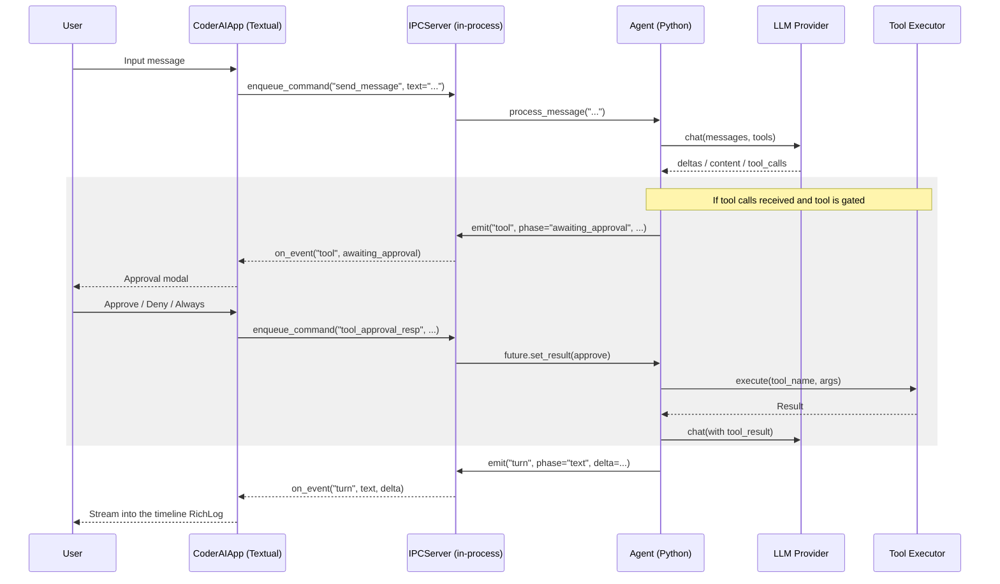

# CoderAI Architecture

This document describes the architecture and design of CoderAI. For the
chat event catalog used by the Textual UI, see
[`docs/CHAT_EVENTS.md`](./docs/CHAT_EVENTS.md). For contributor-oriented
notes, see [`CLAUDE.md`](./CLAUDE.md).

## Workflow Overview

CoderAI is a pure-Python coding agent CLI. The Click entry point in
`coderAI/cli.py` dispatches:

- One-shot subcommands (`config`, `history`, `models`, `status`, `cost`,
  `setup`, `info`, `doctor`, `index`, `search`, `tasks list`) that render
  output via **Rich** helpers in `coderAI/ui/display.py`.
- `coderAI chat`, which launches an in-process **Textual** TUI
  (`coderAI/tui/`) that drives the agent loop and renders the streaming
  timeline.

Inside the chat app, an `IPCServer` (in `coderAI/ipc/jsonrpc_server.py`)
subscribes to the agent's `event_emitter` and forwards events to the
Textual UI via an `on_event(name, data)` callback. UI intent flows back
through `IPCServer.enqueue_command(...)` and is dispatched on the
asyncio loop. Despite the legacy name, the IPC layer no longer crosses
a process boundary — there are no subprocesses, no NDJSON pipes, and no
native UI binary.

### Communication Flow



## Project Structure

```text
.
├── ARCHITECTURE.md          # This file
├── CLAUDE.md                # Contributor-oriented notes (Claude Code guide)
├── COMMANDS.md              # CLI command reference
├── EXAMPLES.md              # Example usage scenarios
├── INSTALL.md               # Installation and setup
├── LICENSE                  # MIT License
├── Makefile                 # Dev shortcuts (test, lint, install, format)
├── README.md                # Project home and quickstart
├── pyproject.toml           # Build metadata, dependencies, ruff/black/mypy config
├── pytest.ini               # Test runner configuration
├── requirements.txt         # Pinned runtime dependencies
├── requirements-dev.txt     # Pinned dev dependencies
├── coderAI/                 # Core Python package
│   ├── __init__.py
│   ├── cli.py               # Click commands (chat, config, history, status, …)
│   ├── agent.py             # Agent orchestrator (loop, providers, sessions, sub-agents)
│   ├── agent_loop.py        # Per-turn execution loop (retry, JSON-arg coercion, iter cap)
│   ├── agent_tracker.py     # Singleton tracker (status, tokens, cost, cancellation)
│   ├── agents.py            # AgentPersona loader (.coderAI/agents/*.md)
│   ├── cli.py               # Click CLI entry points
│   ├── config.py            # Pydantic ConfigManager (~/.coderAI/config.json + env)
│   ├── context.py           # Pinned-file context manager with relevance filtering
│   ├── context_controller.py # Token estimates, compaction, tool-result sizing
│   ├── context_selector.py  # Keyword extraction & relevance-based snippet selection
│   ├── cost.py              # Token / USD cost tracking with budget enforcement
│   ├── code_chunker.py      # AST/regex/sliding-window chunker for embeddings
│   ├── code_indexer.py      # ChromaDB-backed semantic code index
│   ├── error_policy.py      # Retry/error constants and transient-error regex
│   ├── events.py            # Module-level EventEmitter for internal signals
│   ├── history.py           # Session persistence in ~/.coderAI/history/
│   ├── hooks_manager.py     # Loads .coderAI/hooks.json; runs pre/post-tool shells
│   ├── locks.py             # Async resource locks for parallel-agent safety
│   ├── notepad.py           # Shared in-memory notepad for inter-agent messages
│   ├── project_layout.py    # Resolves .coderAI/<subdir> across cwd / pkg / project root
│   ├── read_cache.py        # Recent-read cache to deduplicate tool reads
│   ├── safeguards.py        # Pre-tool validators (interactive cmd, git scope, blocklist)
│   ├── system_prompt.py     # Builds system prompt with tool docs + rule injection
│   ├── tool_executor.py     # Confirmation UX for gated tools (routes via IPC when TUI attached)
│   ├── tool_routing.py      # Dispatches function.name → ToolRegistry or MCP server
│   ├── py.typed             # PEP 561 marker
│   ├── embeddings/          # Embedding providers
│   │   ├── base.py          #   Abstract EmbeddingProvider
│   │   ├── factory.py       #   create_embedding_provider(config)
│   │   └── openai.py        #   text-embedding-3-small (default)
│   ├── ipc/                 # In-process controller for the Textual UI
│   │   ├── __init__.py
│   │   ├── jsonrpc_server.py #   IPCServer: events ↔ on_event ↔ slash commands
│   │   ├── streaming.py     #   IPCStreamingHandler → phased turn events
│   │   └── chat_reference.py #   Plain-text /show reference output
│   ├── llm/                 # LLM backend implementations
│   │   ├── base.py          #   Abstract LLMProvider
│   │   ├── factory.py       #   create_provider(model, config)
│   │   ├── anthropic.py     #   Claude (Opus/Sonnet/Haiku 4.x, 3.x)
│   │   ├── openai.py        #   GPT models
│   │   ├── deepseek.py      #   DeepSeek
│   │   ├── groq.py          #   Groq
│   │   ├── lmstudio.py      #   LM Studio (local, OpenAI-compatible)
│   │   └── ollama.py        #   Ollama (local)
│   ├── tools/               # Tool implementations (56+ tools total)
│   │   ├── base.py          #   Tool ABC + ToolRegistry
│   │   ├── discovery.py     #   Auto-discovery of no-arg Tool subclasses
│   │   ├── filesystem.py    #   read_file, write_file, search_replace, multi_edit,
│   │   │                    #   apply_diff, list_directory, glob_search, move_file,
│   │   │                    #   copy_file, delete_file, create_directory, file_stat,
│   │   │                    #   file_chmod, file_chown, file_readlink
│   │   ├── git.py           #   git_add/status/diff/commit/log/branch/checkout/stash
│   │   │                    #   + push/pull/merge/rebase/revert/reset/show/remote
│   │   │                    #   + blame/cherry_pick/tag
│   │   ├── web.py           #   web_search, read_url, download_file, http_request
│   │   ├── search.py        #   text_search, grep, symbol_search
│   │   ├── semantic_search.py #   semantic_search (natural-language code search)
│   │   ├── terminal.py      #   run_command, run_background, list_processes, kill_process
│   │   ├── subagent.py      #   delegate_task (spawn isolated sub-agents)
│   │   ├── tasks.py         #   manage_tasks (persistent TODO list)
│   │   ├── memory.py        #   save_memory, recall_memory, delete_memory
│   │   ├── mcp.py           #   mcp_connect, mcp_call_tool, mcp_list
│   │   ├── vision.py        #   read_image (base64 for multimodal)
│   │   ├── undo.py          #   undo, undo_history (file backup/rollback)
│   │   ├── lint.py          #   lint (auto-detect linter)
│   │   ├── format.py        #   format (auto-detect formatter)
│   │   ├── repl.py          #   python_repl (isolated subprocess)
│   │   ├── context_manage.py #   pin/unpin files (manual registration)
│   │   ├── planning.py      #   plan (create/show/advance/update/clear)
│   │   ├── notepad.py       #   notepad (shared inter-agent)
│   │   ├── project.py       #   project_context (auto-detect project type)
│   │   └── skills.py        #   use_skill (load .coderAI/skills/*.md)
│   ├── tui/                 # Textual interactive chat
│   │   ├── app.py           #   CoderAIApp + modal screens
│   │   ├── listeners.py     #   EventReducer (agent events → timeline state)
│   │   ├── slash.py         #   Slash command routing
│   │   ├── state.py         #   SessionState + AgentInfo dataclasses
│   │   ├── session_setup.py #   create_agent_session: Agent + IPCServer bootstrap
│   │   ├── help_menu.py     #   /help command catalog
│   │   ├── diff_render.py   #   Compact diff rendering
│   │   ├── timeline_append.py #   Cap timeline length with trim separator
│   │   ├── export.py        #   /export → markdown
│   │   ├── protocol.py      #   AGENT_EVENT_NAMES contract
│   │   └── lib/frozen.py    #   Which timeline items are immutable after completion
│   └── ui/                  # Rich helpers for one-shot CLI subcommands
│       ├── __init__.py
│       └── display.py       #   Tables, markdown, trees, panels
├── docs/
│   └── CHAT_EVENTS.md       # Textual UI event catalog
└── tests/                   # Pytest test suite
```

## Component Details

### 1. CLI Layer (`coderAI/cli.py`)

**Responsibility:** Command-line interface and dispatch.

**Key entry points:**
- `main()` / `cli()` — Click group; default invokes `chat`.
- `chat()` — Calls `coderAI.tui.run_chat_app(...)` to launch the Textual UI.
- `config`, `history`, `info`, `status`, `cost`, `models`, `setup`,
  `doctor`, `index`, `search`, `tasks list` — one-shot subcommands that
  render with Rich.

### 2. Agent Layer (`coderAI/agent.py`, `agent_loop.py`, `tool_executor.py`, `tool_routing.py`, `context_controller.py`)

**Responsibility:** Core orchestration logic.

**Key components:**
- `Agent` (`agent.py`) — Lifecycle, persona loading, provider wiring,
  session state, sub-agent spawning.
- The per-turn loop (`agent_loop.py`) — Retry/backoff for transient LLM
  errors, JSON-arg coercion, iteration cap. Constants
  (`MAX_RETRIES_PER_ITERATION`, `MAX_CONSECUTIVE_ERRORS`,
  transient-error regex) live in `error_policy.py`.
- `ToolExecutor` (`tool_executor.py`) — User confirmation for gated
  tools. Routes through `IPCServer.request_tool_approval` when the
  Textual UI is attached; otherwise falls back to a terminal prompt.
- `tool_routing.py` — Dispatches `function.name` to either the
  `ToolRegistry` or an MCP server (`mcp__<server>__<tool>` wire format).
- `context_controller.py` — Token estimation, truncation, and
  summarization. Reserves `RESPONSE_TOKEN_RESERVE=1024` and
  `TOOL_OVERHEAD_TOKENS=512` when budgeting.

### 3. LLM Providers (`coderAI/llm/`)

**Responsibility:** Abstract different LLM backends behind `LLMProvider`.

**Implementations:** `OpenAIProvider`, `AnthropicProvider`,
`DeepSeekProvider`, `GroqProvider`, `LMStudioProvider`, `OllamaProvider`.
Instantiation goes through `llm/factory.py::create_provider(model, config)`
— do not construct providers directly from `agent.py`.

### 4. In-process IPC controller (`coderAI/ipc/`)

**Responsibility:** Bridge the agent's `event_emitter` and tool lifecycle
events to the Textual UI on the same Python process.

**Key components:**
- `IPCServer` (`jsonrpc_server.py`) — Subscribes to `event_emitter`,
  forwards events via `on_event`, and dispatches UI commands
  (`send_message`, `set_model`, `tool_approval_resp`, etc.) back into
  the agent on the asyncio loop. The `_turn_lock` serialises user turns
  so two `send_message` commands can't interleave.
- `IPCStreamingHandler` (`streaming.py`) — Bridges LLM token deltas
  into phased `turn` events (`start` / `reasoning` / `text` / `end`).
- `chat_reference.py` — Renders plain-text reference output for
  `/show <topic>` slash commands.

### 5. Textual UI (`coderAI/tui/`)

**Responsibility:** Interactive chat experience in the terminal.

**Key components:**
- `CoderAIApp` (`app.py`) — Top-level Textual app: timeline `RichLog`,
  status bar, agents panel, prompt `TextArea`, modal screens for
  approvals/pickers/search.
- `EventReducer` (`listeners.py`) — Stateful reducer that maps incoming
  agent events to `SessionState` and the timeline list. Throttles
  status updates (≤4Hz) and stream flushes (≈8Hz) so the UI stays
  smooth on fast token streams.
- `slash.py` — Local routing for `/`-prefixed input (menus, exits,
  exports) plus pass-through to `IPCServer.enqueue_command(...)` for
  agent-side commands.
- `session_setup.py` — Bootstraps an `Agent` + `IPCServer`, restores
  resumed sessions, and wires `IPCStreamingHandler` as
  `agent.streaming_handler`.

## Design Patterns

1. **Abstract Factory** — `LLMProvider` factory for backend switching.
2. **Registry Pattern** — `ToolRegistry` for dynamic tool discovery
   (`tools/discovery.py` walks the package and instantiates every
   no-arg `Tool` subclass).
3. **Observer Pattern** — `EventEmitter` for decoupling agent logic
   from UI updates.
4. **Command Pattern** — Slash commands are encapsulated as
   `_COMMAND_HANDLERS` keyed by name in `jsonrpc_server.py`.
5. **Reducer Pattern** — `EventReducer` keeps UI rendering pure: events
   in, immutable timeline + session state out.

## Security & Performance

- **Safeguards** (`safeguards.py`) — Interactive-command detection,
  project-directory validation, git-scope guards, staging blocklist
  for junk paths.
- **Cost guard** (`cost.py`) — Per-model token pricing with
  `budget_limit` enforcement from config.
- **Async I/O** — `asyncio` throughout for non-blocking LLM and tool
  calls. Read-only tools run in parallel via `asyncio.gather`; mutating
  tools run sequentially; `delegate_task` is fully serialised
  (`max_parallel_invocations = 1`) to avoid workspace conflicts.
- **Context management** — Reactive compaction in
  `context_controller.py` when estimated tokens exceed
  `context_window - RESPONSE_TOKEN_RESERVE - TOOL_OVERHEAD_TOKENS`.
- **Persistence** — Session-based history stored in
  `~/.coderAI/history/`; semantic index under `.coderAI/index/`.
