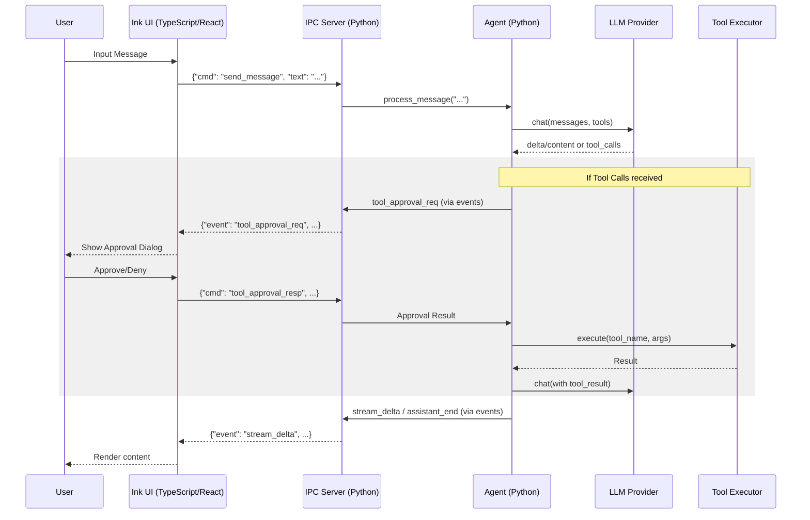

# CoderAI Architecture

This document describes the architecture and design of CoderAI. For the IPC
wire format between the Ink UI and Python, see [`ui/PROTOCOL.md`](./ui/PROTOCOL.md).
For contributor-oriented notes, see [`CLAUDE.md`](./CLAUDE.md).

## Workflow Overview

CoderAI is a coding agent CLI built in Python, paired with a separate **Ink
(TypeScript + React)** interactive UI binary. The two processes communicate
over **NDJSON on stdio** (`coderAI/ipc/`). One-shot CLI commands (`config`,
`history`, `models`, `status`, …) use **Rich** helpers in `coderAI/ui/display.py`.

### Communication Flow

The following diagram illustrates the interaction between the interactive UI, the Python IPC server, the Agent core, and external services (LLMs and Tools).



## Project Structure

A comprehensive map of the CoderAI repository:

```text
.
├── ARCHITECTURE.md          # Architectural overview (this file)
├── CLAUDE.md                # Development guidelines and common commands
├── COMMANDS.md              # Detailed CLI command documentation
├── EXAMPLES.md              # Example usage scenarios
├── INSTALL.md               # Installation and setup instructions
├── LICENSE                  # MIT License
├── Makefile                 # Build and test shortcuts
├── README.md                # Project home and quickstart
├── pyproject.toml           # Python project configuration
├── pytest.ini               # Test runner configuration
├── requirements.txt         # Core dependencies
├── requirements-dev.txt     # Development dependencies
├── test_installation.py     # Installation smoke test
├── manual_parallel_subagents.py # sub-agent stress test
├── manual_subagent_delegation.py # sub-agent stress test
├── coderAI/                 # Core Python package
│   ├── __init__.py
│   ├── agent.py             # Main Agent orchestration logic
│   ├── agent_loop.py        # Execution loop for complex tasks
│   ├── agent_tracker.py     # Tracking active agents and their status
│   ├── agents.py            # Agent factories and variations
│   ├── binary_manager.py    # Manages UI binary downloads/versioning
│   ├── cli.py               # Click commands for the CLI
│   ├── config.py            # Pydantic configuration management
│   ├── context.py           # Context window and history management
│   ├── context_controller.py # Token estimates, compaction, tool-result sizing
│   ├── project_layout.py    # Resolve .coderAI/skills, .coderAI/agents, etc.
│   ├── context_selector.py  # Logic for picking relevant context
│   ├── cost.py              # Token and USD cost tracking
│   ├── events.py            # Global EventEmitter for internal signals
│   ├── history.py           # Session persistence logic
│   ├── locks.py             # Concurrency primitives
│   ├── notepad.py           # Shared data storage for agent
│   ├── py.typed             # PEP 561 marker
│   ├── safeguards.py        # Safety and limit checks
│   ├── skills.py            # Skill-based tool grouping
│   ├── system_prompt.py     # Dynamic system prompt generation
│   ├── tool_executor.py     # Logic for running tool calls
│   ├── ipc/                 # IPC communication bridge
│   │   ├── __init__.py
│   │   ├── entry.py         # Entry point for the Ink UI
│   │   ├── jsonrpc_server.py # NDJSON/JSONRPC server implementation
│   │   └── streaming.py     # Redirects deltas to IPC events
│   ├── llm/                 # LLM backend implementations
│   │   ├── __init__.py
│   │   ├── base.py          # Abstract LLMProvider interface
│   │   ├── factory.py       # Provider instantiation logic
│   │   ├── anthropic.py     # Anthropic Claude support
│   │   ├── deepseek.py      # DeepSeek support
│   │   ├── groq.py          # Groq support
│   │   ├── lmstudio.py      # LM Studio support
│   │   ├── ollama.py        # Ollama support
│   │   └── openai.py        # OpenAI support
│   ├── tools/               # Tool implementations
│   │   ├── __init__.py
│   │   ├── base.py          # Tool registry and base class
│   │   ├── filesystem.py    # File read/write/list/glob
│   │   ├── git.py           # Git status/log/diff/commit
│   │   ├── web.py           # Search and URL content
│   │   ├── search.py        # Text search and grep
│   │   ├── terminal.py      # Command execution
│   │   ├── subagent.py      # Delegation to sub-agents
│   │   ├── tasks.py         # Task tracking
│   │   ├── memory.py        # Persistence for context
│   │   ├── mcp.py           # Model Context Protocol support
│   │   ├── vision.py        # Image analysis
│   │   ├── undo.py          # File history and rollback
│   │   ├── lint.py          # Code quality checks
│   │   ├── context_manage.py # Manual context pinning
│   │   ├── planning.py      # Agent planning tools
│   │   └── format.py        # Data formatting
│   └── ui/                  # Rich implementation for non-interactive CLI
│       ├── __init__.py
│       └── display.py       # Rich tables, markdown, and trees
├── tests/                   # Extensive test suite
└── ui/                      # Ink/React based interactive UI
    ├── PROTOCOL.md          # Wire format specification
    ├── package.json         # Node.js dependencies
    ├── bun.lock             # Bun lockfile
    ├── tsconfig.json        # TypeScript configuration
    ├── scripts/             # Build and compilation scripts
    └── src/                 # Application source code
        ├── App.tsx          # Main entry component
        ├── cli.tsx          # In-terminal UI logic
        ├── protocol.ts      # Client-side IPC protocol implementation
        ├── theme.ts         # Visual styling definitions
        ├── components/      # Reusable Ink components
        ├── hooks/           # State management hooks
        └── rpc/             # Client-side RPC messaging
```

## Component Details

### 1. CLI Layer (`coderAI/cli.py`)

**Responsibility:** Command-line interface and user interaction.

**Key Functions:**
- `main()` — Entry point.
- `chat()` — Spawns the Ink UI binary, which runs `python -m coderAI.ipc.entry`.
- `config()` / `history()` — Configuration and session management.

### 2. Agent Layer (`coderAI/agent.py` & `coderAI/agent_loop.py`)

**Responsibility:** Core orchestration logic.

**Key Components:**
- `Agent` class (`agent.py`) - Main excavating orchestrator.
- `ExecutionLoop` (`agent_loop.py`) - Handles multi-step reasoning and tool execution cycles.
- `ToolExecutor` (`tool_executor.py`) - User confirmation / approval for gated tools (execution goes through `ToolRegistry` in `agent_loop`).

### 3. LLM Providers (`coderAI/llm/`)

**Responsibility:** Abstract different LLM backends.

**Implementations:**
- `OpenAIProvider` - OpenAI API (GPT-4o, o1, o3-mini).
- `AnthropicProvider` - Anthropic API (Claude 3.5 Sonnet/Opus).
- `DeepSeekProvider` - DeepSeek API (v3, R1).
- `GroqProvider` - Groq Llama/Mixtral models.
- `LMStudioProvider` / `OllamaProvider` - Local model support.

### 4. IPC Bridge (`coderAI/ipc/`)

**Responsibility:** NDJSON communication between Python and the Ink UI.

**Key Components:**
- `entry.py` - Sets up the `Agent` and `IPCServer`.
- `jsonrpc_server.py` - Manages the stdio pipe, JSONRPC dispatch, and event emitting.
- `streaming.py` - Intercepts LLM token deltas and converts them to IPC `stream_delta` events.

### 5. Interactive UI (`ui/`)

**Responsibility:** Standalone React/Ink binary providing a modern terminal experience.

**Key Features:**
- Markdown rendering in terminal.
- Interactive tool approval prompts.
- Syntax highlighting for code samples.
- Live status bars (cost, tokens, context).

## Design Patterns

1. **Abstract Factory**: `LLMProvider` factory for backend switching.
2. **Registry Pattern**: `ToolRegistry` for dynamic tool discovery.
3. **Observer Pattern**: `EventEmitter` for decoupling agent logic from UI updates.
4. **Command Pattern**: Encapsulated actions for tools and CLI operations.

## Security & Performance

- **Safeguards**: Rate limiting, budget tracking, and confirmation prompts for high-risk actions.
- **Async I/O**: `asyncio` throughout for non-blocking network and tool calls.
- **Context Management**: Smart pruning and compaction to stay within LLM token limits.
- **Persistence**: Session-based history stored in `~/.coderAI/history/`.

