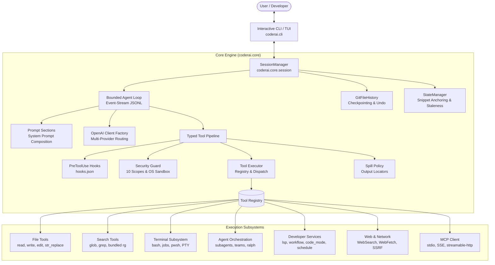

# 🏗️ CoderAI Architecture & System Design

**CoderAI** is an autonomous terminal AI pair programming system architected for high reliability, deterministic tool execution, token efficiency, and defense-in-depth security. The codebase strictly decouples the UI-agnostic core engine (`coderai.core`) from the rich interactive terminal interface (`coderai.cli`).

---

## 📑 Table of Contents

1. [High-Level Architecture](#high-level-architecture)
2. [Core Design Principles](#core-design-principles)
3. [Agent Lifecycle & Turn Execution Flow](#agent-lifecycle--turn-execution-flow)
4. [Subsystem Breakdown](#subsystem-breakdown)
   - [1. Bounded Agent Loop & Event Stream](#1-bounded-agent-loop--event-stream)
   - [2. Snippet-Scoped File Editing Engine](#2-snippet-scoped-file-editing-engine)
   - [3. Defense-in-Depth Security & OS Sandboxing](#3-defense-in-depth-security--os-sandboxing)
   - [4. GitFileHistory Checkpointing & Instant Undo](#4-gitfilehistory-checkpointing--instant-undo)
   - [5. Multi-Agent Swarm & Team Orchestration](#5-multi-agent-swarm--team-orchestration)
   - [6. High-Performance Search & Discovery](#6-high-performance-search--discovery)
   - [7. Developer Services & Execution Engines](#7-developer-services--execution-engines)
   - [8. Model Context Protocol (MCP) Client](#8-model-context-protocol-mcp-client)
5. [Directory & Package Map](#directory--package-map)
6. [Security & Isolation Model](#security--isolation-model)
7. [Data Persistence & State Management](#data-persistence--state-management)

---

## High-Level Architecture


```mermaid
graph TD
    User([User / Developer]) <--> CLI[Interactive CLI / TUI<br/>coderai.cli]
    
    CLI <--> SessionMgr[SessionManager<br/>coderai.core.session]
    
    subgraph "Core Engine (coderai.core)"
        SessionMgr --> Loop[Bounded Agent Loop<br/>Event-Stream JSONL]
        SessionMgr --> GitHist[GitFileHistory<br/>Checkpointing & Undo]
        SessionMgr --> StateMgr[StateManager<br/>Snippet Anchoring & Staleness]
        
        Loop --> PromptSec[Prompt Sections<br/>System Prompt Composition]
        Loop --> Client[OpenAI Client Factory<br/>Multi-Provider Routing]
        
        Loop --> Pipeline[Typed Tool Pipeline]
        
        Pipeline --> PreHook[PreToolUse Hooks<br/>hooks.json]
        Pipeline --> SandboxGuard[Security Guard<br/>10 Scopes & OS Sandbox]
        Pipeline --> Executor[Tool Executor<br/>Registry & Dispatch]
        Pipeline --> SpillPolicy[Spill Policy<br/>Output Locators]
        
        Executor --> ToolRegistry[(Tool Registry)]
    end
    
    subgraph "Execution Subsystems"
        ToolRegistry --> FileOps[File Tools<br/>read, write, edit, str_replace]
        ToolRegistry --> SearchOps[Search Tools<br/>glob, grep, bundled rg]
        ToolRegistry --> TerminalOps[Terminal Subsystem<br/>bash, jobs, pwsh, PTY]
        ToolRegistry --> AgentsOps[Agent Orchestration<br/>subagents, teams, ralph]
        ToolRegistry --> DevOps[Developer Services<br/>lsp, workflow, code_mode, schedule]
        ToolRegistry --> WebOps[Web & Network<br/>WebSearch, WebFetch, SSRF]
        ToolRegistry --> MCPOps[MCP Client<br/>stdio, SSE, streamable-http]
    end
```

---

## Core Design Principles

1. **Strict UI / Engine Decoupling**:
   `coderai.core` has zero dependency on terminal rendering libraries (e.g. `rich` or `readline`). All interactions flow through typed event streams and public APIs in `SessionManager`, making the core fully embeddable in IDE extensions, web servers, or CI/CD harnesses.

2. **Snippet-Anchored Precision**:
   Rather than rewriting entire files or relying on fuzzy line matching, `read` emits an anchored `snippet_id` with content hash verification. `edit` calls must target an active `snippet_id`, preventing hallucinated line numbers, accidental overwrites, and race conditions.

3. **Deterministic Turn Bounding**:
   Agent turns follow a strict cycle with token-threshold compaction, multi-turn loop guards, and repeat-action detection to eliminate runaway execution loops.

4. **Defense-in-Depth & Fail-Closed Security**:
   Every side-effecting action is validated against a 10-scope permission matrix, optional PreToolUse hooks, and OS-level sandboxing (macOS Seatbelt, Linux Bubblewrap).

5. **Zero-Loss Checkpointing**:
   Every turn automatically snapshots modified files to `.git_history`, giving developers one-command rollback (`/undo`) and diff inspection (`/diff`) without polluting the main Git commit history.

---

## Agent Lifecycle & Turn Execution Flow

```mermaid
sequenceDiagram
    autonumber
    actor User
    participant CLI as Interactive CLI (TUI)
    participant SM as SessionManager
    participant Loop as Agent Loop
    participant LLM as Frontier LLM Provider
    participant Sec as Security & Sandbox
    participant Tools as Tool Registry & Subsystems
    participant Hist as GitFileHistory

    User->>CLI: Prompt Input / Slash Command
    CLI->>SM: run_turn(user_prompt)
    SM->>Hist: Snapshot pre-turn file state
    SM->>Loop: Execute Bounded Turn
    
    loop Turn Execution Cycle
        Loop->>LLM: Stream completion with system prompt & history
        LLM-->>Loop: Stream reasoning trace & tool_calls
        Loop->>Sec: Evaluate permission scope & sandbox policy
        alt Permission Required
            Sec->>CLI: Request interactive approval
            CLI-->>Sec: Approved / Denied
        end
        Loop->>Tools: Dispatch tool execution
        Tools-->>Loop: Tool result (with spill-to-disk if > threshold)
        Loop->>SM: Append event to append-only JSONL
    end
    
    SM->>Hist: Commit turn checkpoint to .git_history
    SM-->>CLI: Turn complete (tokens, duration, diffs)
    CLI-->>User: Render output card & prompt status
```

---

## Subsystem Breakdown

### 1. Bounded Agent Loop & Event Stream
- **Path**: `coderai/core/agent_loop.py`, `coderai/core/session.py`, `coderai/core/session_store.py`
- **Responsibilities**:
  - Orchestrates multi-step agent reasoning and tool invocation cycles.
  - Implements **Loop Guards** to detect repetitive, identical tool invocations and inject corrective reminder notices.
  - Enforces **Context Window Compaction**: when token counts approach limits, `/compact` synthesizes prior turns into a structured summary while preserving pairing-balanced tool calls and checkpoint hashes.
  - Persists all turn interactions to append-only JSONL files for session resumption and auditing.

### 2. Snippet-Scoped File Editing Engine
- **Path**: `coderai/core/state.py`, `coderai/core/tools/file_ops.py`, `coderai/core/tools/str_replace_editor.py`
- **Responsibilities**:
  - **Anchored Read**: `read` loads file slices with unique `snippet_id` identifiers and version hashes.
  - **Staleness Detection**: `edit` validates that the target file has not been modified externally since the snippet was generated.
  - **Whitespace Tolerance & Unique Matching**: Safely replaces exact code blocks without drifting across identical functions.
  - **Universal Fallback**: Supports `str_replace_editor` for standard view/create/replace workflows.

### 3. Defense-in-Depth Security & OS Sandboxing
- **Path**: `coderai/core/permissions.py`, `coderai/core/sandbox.py`, `coderai/core/hooks.py`
- **Responsibilities**:
  - **10 Fine-Grained Scopes**:
    - File Read: `read-in-cwd`, `read-out-cwd`
    - File Write: `write-in-cwd`, `write-out-cwd`
    - File Delete: `delete-in-cwd`, `delete-out-cwd`
    - Git Ops: `query-git-log`, `mutate-git-log`
    - External: `network`, `mcp`
  - **3 Presets**: `read-only`, `workspace-write`, `danger-full-access`.
  - **OS-Level Sandboxing**: Wraps bash commands in macOS `sandbox-exec` (Seatbelt profile) or Linux `bwrap` (Bubblewrap) to isolate filesystem and network access.
  - **PreToolUse Hooks**: Executes custom scripts from `.coderai/hooks.json` before tool dispatch.

### 4. GitFileHistory Checkpointing & Instant Undo
- **Path**: `coderai/core/common/file_history.py`
- **Responsibilities**:
  - Tracks all file mutations per turn inside `.coderai/.git_history/` without touching the user's working branch.
  - Enables instant rollback via `/undo` and diff preview via `/diff`.

### 5. Multi-Agent Swarm & Team Orchestration
- **Path**: `coderai/core/agents.py`, `coderai/core/subagent.py`, `coderai/core/teams/`
- **Responsibilities**:
  - **Continuable Subagents**: Long-running background agents with inter-agent messaging (`send_message`, `interrupt_agent`).
  - **One-Shot Task Delegation**: Forked subagent workers with isolated state (`subagent_fork`).
  - **Team Task Board**: Synchronized task assignment (`spawn_teammate`, `team_task_*`, `wait_agent`).
  - **Ralph Verification**: Automated test-driven completion and feedback loop.

### 6. High-Performance Search & Discovery
- **Path**: `coderai/core/tools/search.py`, `coderai/core/spill.py`, `coderai/vendor/`
- **Responsibilities**:
  - Bundles pre-compiled `ripgrep` binary for ultra-fast regex content searching (`grep`) and file pattern matching (`glob`).
  - Automatic fallback to Python regex engine if native binary is unavailable.
  - Spill-to-disk policy stores oversized search outputs into temporary locators to prevent LLM context exhaustion.

### 7. Developer Services & Execution Engines
- **Path**: `coderai/core/lsp/`, `coderai/core/terminal/`, `coderai/core/code_mode/`, `coderai/core/workflow/`
- **Responsibilities**:
  - **LSP Client**: Language Server Protocol integration for symbol definition, hover, references, and document symbols.
  - **PTY Manager**: Interactive pseudoterminals (`terminal_open`, `terminal_send`, `terminal_read`, `terminal_signal`).
  - **Code Mode**: In-process sandboxed Python runtime for data processing and analysis.
  - **Workflow Engine**: Asynchronous multi-phase Python workflow execution.

### 8. Model Context Protocol (MCP) Client
- **Path**: `coderai/core/mcp/`
- **Responsibilities**:
  - Connects to external MCP servers over `stdio`, `sse`, or `streamable-http`.
  - Dynamically registers and exposes external Tools, Resources, and Prompts to the agent loop.
  - Supports custom headers, environment variable interpolation, and private IP blocking.

---

## Directory & Package Map

```
coderai/
├── main.py                         # CLI entry point -> coderai.cli.app.main
├── py.typed                        # PEP 561 typing marker
│
├── cli/                            # Presentation Layer (Rich Terminal UI)
│   ├── app.py                      # REPL loop, argument parsing, interactive approval
│   ├── commands.py                 # Slash-command registry and handlers
│   ├── session_factory.py          # SessionManager factory and config wiring
│   ├── ascii_art.py                # Banner and theme rendering
│   ├── completer.py                # Readline autocompletion & fuzzy matching
│   ├── diff_render.py              # Syntax-highlighted diff rendering
│   ├── exit_summary.py             # Session analytics and exit cards
│   ├── export_render.py            # Session export formatting (Markdown/JSON)
│   ├── file_mention.py             # @file path detection and context expansion
│   ├── fuzzy.py                    # Fuzzy subsequence search ranking
│   ├── interactive_menu.py         # Interactive model, session, and skill pickers
│   ├── plan_render.py              # Plan checklist table rendering
│   ├── status_bar.py               # Real-time token, model, and plan status bar
│   ├── thinking.py                 # Live reasoning & thinking block renderer
│   ├── tool_card.py                # Tool execution cards with timing & results
│   └── welcome.py                  # Welcome screen & quick-start guide
│
├── core/                           # Core Engine (UI-Agnostic)
│   ├── agents.py                   # Continuable subagent manager
│   ├── agent_loop.py               # Bounded turn execution controller
│   ├── goals.py                    # Session goals store (/goal)
│   ├── hooks.py                    # PreToolUse hook execution engine
│   ├── jobs.py                     # Background process job store
│   ├── openai_client.py            # Multi-provider LLM client factory & routing
│   ├── permissions.py              # 10 scopes, policy evaluation, presets
│   ├── prompt.py                   # System prompt builder & tool schema generation
│   ├── prompt_sections.py          # Ordered tool schemas and prompt sections
│   ├── sandbox.py                  # Native OS sandbox (Seatbelt / Bubblewrap)
│   ├── schedule.py                 # Timer and cron schedule subsystem
│   ├── session.py                  # SessionManager public API & lifecycle
│   ├── session_store.py            # Append-only JSONL session persistence
│   ├── session_log.py              # Message derivation and log utilities
│   ├── settings.py                 # Multi-tier configuration resolver
│   ├── spill.py                    # Spill-to-file store & locator generation
│   ├── state.py                    # Snippet manager, file versioning, staleness
│   ├── subagent.py                 # Subagent orchestration plane
│   ├── web_providers.py            # Pluggable web search backends (Tavily/DuckDuckGo)
│   │
│   ├── code_mode/                  # Interactive sandboxed Python execution
│   ├── common/                     # Core utilities (GitFileHistory, process tree, logging)
│   ├── lsp/                        # Language Server Protocol client implementation
│   ├── mcp/                        # Model Context Protocol (stdio, SSE, HTTP)
│   ├── network/                    # HTTP client, SSRF protection, HTML sanitizer
│   ├── session_query/              # Full-text JSONL session indexer and search
│   ├── skill/                      # Skill discovery (`SKILL.md`) and loader
│   ├── teams/                      # Agent swarm task board and teammate coordinator
│   ├── terminal/                   # PTY pseudoterminal manager
│   ├── tools/                      # Built-in tool definitions & implementations
│   └── workflow/                   # Multi-phase async workflow engine
│
├── vendor/                         # Bundled standalone binaries (ripgrep)
└── skills/                         # Built-in agent skills
```

---

## Security & Isolation Model

```
                    ┌──────────────────────────────────────────────┐
                    │               User Prompt                    │
                    └──────────────────────┬───────────────────────┘
                                           ▼
                    ┌──────────────────────────────────────────────┐
                    │           PreToolUse Hooks (hooks.json)      │
                    └──────────────────────┬───────────────────────┘
                                           ▼
                    ┌──────────────────────────────────────────────┐
                    │        Permission Scope Matrix (10 Scopes)   │
                    │   [read-in-cwd]  [write-in-cwd]  [network]   │
                    │   [delete-in-cwd] [mutate-git-log] [mcp]...  │
                    └──────────────────────┬───────────────────────┘
                                           ▼
                    ┌──────────────────────────────────────────────┐
                    │       Native OS Sandbox (Seatbelt / bwrap)   │
                    │   • Read-only root / isolated temp dirs      │
                    │   • Blocked outbound sockets (if offline)    │
                    └──────────────────────┬───────────────────────┘
                                           ▼
                    ┌──────────────────────────────────────────────┐
                    │           Target System Execution            │
                    └──────────────────────────────────────────────┘
```

---

## Data Persistence & State Management

| Data Artifact | Location | Format | Purpose |
|---|---|---|---|
| **Session Events** | `~/.coderai/sessions/<id>.jsonl` or `.coderai/sessions/` | JSONL | Append-only complete event log of turns, messages, and tool calls |
| **Turn Checkpoints** | `.coderai/.git_history/` | Git Bare Repo | Snapshots of workspace files for `/undo` and `/diff` |
| **Settings** | `.coderai/settings.json` / `~/.coderai/settings.json` | JSON | Project and global configuration |
| **Command History** | `~/.coderai/history` | Text | Cross-session interactive REPL input history |
| **Spill Data** | `.coderai/spill/` | Raw files | Large tool output buffers indexed by locator hashes |
| **Agent Teams** | `.coderai/teams/` | JSON | Shared task board and teammate status |
