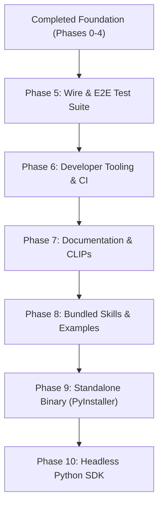

# CoderAI Port & Architecture Plan — Forward Roadmap

**Gold Standard Reference**: `/Users/adityaraut/Downloads/kimi-cli-main`  
**Target Package**: `coderai/` (CLI terminal platform, async wire runtime, autonomous agent swarms)

> **Status note (2026-09-12):** this plan is the historical record of the port.
> Phases 0–7 were completed here; **Phases 8 (skills), 9 (binary), and 10 (SDK)
> are also complete** — see `REMAINING_PLAN.md` §§1–3 (P2/P3/P4) for the
> completion evidence. `REMAINING_PLAN.md` is the current handoff document.

---

## 1. Completed Foundation Summary

All core engine components, tool sandboxes, ACP server protocols, and interactive terminal interfaces have been successfully ported, modularized, and validated against the test suite.

| Phase | Description | Scope & Key Modules | Status | Verification |
|---|---|---|---|---|
| **Phase 0** | Dependencies & Trivial Leaves | `constant.py`, `prompts/`, `acp/version.py`, `tools/display.py`, `soul/message.py`, `background/` | **COMPLETED** | Bytecode & Imports Clean |
| **Phase 1** | Leaf Features with In-Repo Analogues | `clipboard.py`, `crash.py`, `transport.py`, `worker.py`, dynamic injections (`plan_mode`, `afk_mode`), `flow/` | **COMPLETED** | Unit tests passing |
| **Phase 2** | Engine Core (`kosong` + `kaos`) | `llm.py`, `soul/toolset.py`, `soul/context.py`, `soul/slash.py`, `metadata.py`, `hooks/` | **COMPLETED** | 8/8 engine tests passed |
| **Phase 2b**| `core/session.py` Modularization | Extracted `session_models`, `session_background`, `session_fork_ops`, `session_completion`, `session_approval` | **COMPLETED** | 273/273 tests passing |
| **Phase 3** | ACP Server & Subagent Wire Runner | `acp/server.py`, `acp/session.py`, `acp/kaos.py`, `app.py`, `soul/approval.py`, `tools/shell/` | **COMPLETED** | 7/7 ACP tests passed |
| **Phase 4** | Interactive Shell & Rich Live View | `ui/shell/prompt.py`, `visualize/_live_view.py`, `_interactive.py`, `diff_render.py`, `broadcast.py` | **COMPLETED** | 12/12 UI tests passed |
| **UI Fix** | UI Review & Persona Integration | Swarm workers (`TeamManager`), dynamic roles (`.coderai/agents/*.md`), 3-row welcome grid | **COMPLETED** | 299/299 tests passing |
| **Phase 5** | Web UI & FastAPI Servers (`vis/`, `web/`) | Removed browser UI and web backends in adherence to the Pure Terminal CLI constraint | **DROPPED** | Pure CLI verified |
| **Phase 6** | Developer Tooling, CI Scripts & Release Automation | `scripts/inject_build_sha.py`, `scripts/check_dependency_versions.py`, `scripts/telemetry_debug_server.py`, `scripts/install.ps1`, `Makefile` (`build-sha`, `check-deps`, `telemetry-debug`, `test-e2e`), `.github/workflows/ci.yml`, `tests/test_phase6_tooling.py` | **COMPLETED** | 9/9 tooling tests passed; `make check-deps` + `make build-sha` verified |
| **Phase 7** | Production Documentation & Architectural Proposals (CLIPs) | `docs/configuration.md`, `docs/agent-roles.md`, `docs/mcp.md`, `docs/skills.md`, `docs/troubleshooting.md`, `clips/clip-001` … `clip-005` | **COMPLETED** | Guides + RFCs grounded in `coderai/` source |
| **Phase 8** | Bundled Skills Library & Examples | `.coderai/skills/` (skill-creator, feature-smoke-test, pull-request, release, worktree-status), `examples/` | **COMPLETED** | See `REMAINING_PLAN.md` P3 |
| **Phase 9** | Standalone Binary Packaging | `coderai.spec`, `coderai/utils/pyinstaller.py`, `scripts/verify_binary.py` | **COMPLETED** | 61MB single-file build verified; see `REMAINING_PLAN.md` P2 |
| **Phase 10** | Headless SDK | `sdks/coderai-sdk/` (`client.py`, `models.py`), integration tests | **COMPLETED** | Offline + integration suites green; see `REMAINING_PLAN.md` P2 |

---

## 2. Architectural Ground Rules

1. **Terminal Purity**: CoderAI is strictly a terminal CLI and daemon application. No web frontends, browser viewers, or HTTP HTML renderers. All inspection and interaction occur via Rich, prompt-toolkit, or ACP.
2. **Python 3.10+ Compatibility**: Preserve Python 3.10 and 3.11 compatibility. Never use PEP 695 syntax (`type Alias = ...` or `def func[T](...)`). Use `typing.TypeVar`, `Union`, and `typing_extensions`.
3. **Zero Placeholder Files**: Every created file must be fully functional, imported, and exercised by automated tests or integration scripts.
4. **Memory Isolation (RAM Rule)**: Never run the entire test suite in a single process. Run test suites per-file:
   ```bash
   /usr/local/bin/python3 -m pytest tests/<test_file>.py -p no:cacheprovider --benchmark-disable -q
   ```
   (`Makefile test` / `test-e2e` and CI implement this as a per-file loop. CI
   runners use the matrix `python`; local dev uses `/usr/local/bin/python3`,
   which is the interpreter carrying `kosong`/`kaos`.)
5. **Compilation Cleanliness**: After each phase, `python3 -m compileall -q coderai tests scripts` must produce zero errors or warnings.
6. **Backward Compatibility**: Existing CLI invocation syntax (`coderai`, `cai`), configuration paths (`~/.coderai/`), and legacy tool bindings must remain operational through forwarding shims where needed.

---

## 3. New Implementation Plan

The forward roadmap focuses on wire protocol integration testing, release automation tooling, comprehensive documentation, architectural proposals (CLIPs), bundled skills, and standalone binary packaging.

```
                    ┌─────────────────────────────────────────────────────────┐
                    │                   CODERAI FORWARD ROADMAP               │
                    └─────────────────────────────────────────────────────────┘
                                                 │
          ┌──────────────────────────────────────┼──────────────────────────────────────┐
          │                                      │                                      │
          ▼                                      ▼                                      ▼
   [Phase 5: Wire & E2E]             [Phase 6: Tooling & CI]                [Phase 7: Docs & CLIPs]
   • Wire test harnesses             • inject_build_sha.py                  • Comprehensive guides
   • Tool approvals & sandboxes      • check_dependency_versions.py         • Configuration & MCP
   • Prompt synthesis & replay       • telemetry_debug_server.py            • Architecture proposals
   • Interruption & steering         • install.ps1 & Makefile               • Troubleshooting manual
          │                                      │                                      │
          └──────────────────────────────────────┼──────────────────────────────────────┘
                                                 │
                         ┌───────────────────────┴───────────────────────┐
                         │                                               │
                         ▼                                               ▼
              [Phase 8: Skills & Demos]                       [Phase 9: Binary & SDK]
              • Bundled skills library                        • PyInstaller spec (coderai.spec)
              • skill-creator & smoke-test                    • pyinstaller hook helpers
              • coderai-psql terminal demo                    • Headless Python SDK
              • Programmatic swarm examples                   • Cross-platform build pipeline
```

---

### Phase 5 — End-to-End Wire Protocol & Integration Test Suite (`tests_e2e/`)

Build out the full asynchronous wire protocol integration test suite (porting and adapting Kimi's `tests_e2e/` harness) to test event streams, tool approvals, cancellation, and external MCP coordination without requiring live LLM calls.

| Target File | Source Reference | Lines | Scope & Technical Strategy |
|---|---|---|---|
| `tests_e2e/__init__.py` | `tests_e2e/__init__.py` | 5 | Package marker for end-to-end wire test suite. |
| `tests_e2e/wire_helpers.py` | `tests_e2e/wire_helpers.py` | 600 | Wire test harness: mock wire protocol streams, fake LLM event generators (`FakeKimiSoul`), event history collectors, and turn step assertion utilities. |
| `tests_e2e/test_wire_protocol.py` | `tests_e2e/test_wire_protocol.py` | 439 | Wire message framing, chunk sequencing, payload serialization/deserialization, and event ordering validation. |
| `tests_e2e/test_wire_approvals_tools.py` | `tests_e2e/test_wire_approvals_tools.py` | 1273 | Thorough testing of tool permission boundaries: default confirmation, YOLO mode, AFK mode, plan-mode read-only enforcement, tool rejections, and custom sidecars. |
| `tests_e2e/test_wire_prompt.py` | `tests_e2e/test_wire_prompt.py` | 539 | Context window assembly, system prompt injection with frontmatter parsing, history replay, and token counting validation. |
| `tests_e2e/test_wire_sessions.py` | `tests_e2e/test_wire_sessions.py` | 505 | Wire-level session life cycle: session creation, resume, fork/branching, turn checkpoints, and history compaction over wire. |
| `tests_e2e/test_wire_skills_mcp.py` | `tests_e2e/test_wire_skills_mcp.py` | 427 | End-to-end wire integration of external MCP servers (stdio/sse), tool schema conversion, and skill invocation flows. |
| `tests_e2e/test_wire_steer.py` | `tests_e2e/test_wire_steer.py` | 150 | Mid-turn steering, user interruption signals, task cancellation, and graceful event stream teardown. |
| `tests_e2e/test_wire_question.py` | `tests_e2e/test_wire_question.py` | 280 | Interactive user question handling (`AskUser`) routed through wire events and response integration. |
| `tests_e2e/test_wire_errors.py` | `tests_e2e/test_wire_errors.py` | 259 | Error recovery testing: provider timeouts, network disconnections, malformed JSON, and tool crash containment. |
| `tests_e2e/test_wire_auth.py` | `tests_e2e/test_wire_auth.py` | 115 | Authentication event routing, token validation, and permission denial over wire. |
| `tests_e2e/test_wire_config.py` | `tests_e2e/test_wire_config.py` | 180 | Wire-driven configuration switches: model hot-swapping, reasoning effort changes, and dynamic injection toggling. |
| `tests_e2e/test_mcp_cli.py` | `tests_e2e/test_mcp_cli.py` | 292 | CLI `/mcp` command tests: `list`, `reconnect`, `tools`, `prompts`, `resources`. |

**Deliverables**:
- Fully functional `tests_e2e/` test harness runnable via standard pytest:
  ```bash
  python3 -m pytest tests_e2e/test_wire_protocol.py -p no:cacheprovider -q
  ```

---

### Phase 6 — Developer Tooling, CI Scripts & Release Automation

Expand repository developer tooling, cross-platform installability, and release validation scripts.

| Target File | Source Reference | Lines | Scope & Technical Strategy |
|---|---|---|---|
| `scripts/inject_build_sha.py` | `scripts/inject_build_sha.py` | 100 | CI script to resolve git commit SHA and origin remote, writing provenance to `coderai/_build_info.py` before release builds. |
| `scripts/check_dependency_versions.py` | `scripts/check_kimi_dependency_versions.py` | 120 | Verifies installed runtime dependencies match or exceed constraints in `pyproject.toml`, catching breaking version drifts early. |
| `scripts/telemetry_debug_server.py` | `scripts/telemetry_debug_server.py` | 120 | Lightweight local HTTP server to receive, filter, and inspect telemetry payloads and crash dumps during local testing. |
| `scripts/install.ps1` | `scripts/install.ps1` | 40 | Standalone PowerShell installer script for Windows users, providing automated `uv`/`pipx`/`pip` setup. |
| `Makefile` | `Makefile` | 80 | Clean development Makefile with targets for `install`, `lint`, `format`, `test`, `build`, `self-check`, and `clean`. |
| `.github/workflows/ci.yml` | `.github/workflows/` | 150 | Consolidated GitHub Actions CI workflow running multi-platform linting, typing, unit tests, and packaging tests across Ubuntu, macOS, and Windows. |

**Deliverables**:
- `python3 scripts/inject_build_sha.py` stamps build SHA cleanly into `coderai/_build_info.py`.
- `python3 scripts/check_dependency_versions.py` verifies all package versions.
- Developer workflows simplified via `make test` and `make lint`.

---

### Phase 7 — Production Documentation & Architectural Proposals (CLIPs)

Deliver comprehensive documentation for users and contributors, and formalize architecture decision records into CoderAI Language & Interface Proposals (CLIPs).

| Target File | Category | Scope & Technical Strategy |
|---|---|---|
| `docs/configuration.md` | User Guide | Complete configuration manual: providers (OpenAI, Anthropic, Gemini, Ollama, DeepSeek), API keys, custom endpoints, default models, reasoning effort levels, and permission presets. |
| `docs/agent-roles.md` | User Guide | Guide to agent personas: bundled roles (`default`, `okabe`) and discovered roles (`architect`, `planner`, `code-reviewer`, `security-reviewer`, `tdd-guide`, `build-error-resolver`), frontmatter spec, and hot-switching via `/agent`. |
| `docs/mcp.md` | User Guide | Model Context Protocol integration guide: setting up stdio and SSE MCP servers, OAuth authentication, tool approvals, and the `/mcp` command suite. |
| `docs/skills.md` | User Guide | Creating and managing workspace skills: folder structure, YAML frontmatter, execution permissions, scripts, and progressive disclosure patterns. |
| `docs/troubleshooting.md` | User Guide | Comprehensive troubleshooting guide: running `/doctor`, permission resets, sandboxing issues, proxy settings, and session recovery. |
| `clips/clip-001-wire-protocol.md` | Architecture RFC | Formal specification of CoderAI's asynchronous wire protocol, event types, chunk routing, and streaming lifecycle. |
| `clips/clip-002-acpkaos.md` | Architecture RFC | Agent Control Protocol (ACP) specification, pseudo-terminal (PTY) isolation, and JSON-RPC method dispatch. |
| `clips/clip-003-agent-flow.md` | Architecture RFC | Architecture of autonomous agent swarms, dynamic role discovery, DAG task boards, and background worker mailboxes. |
| `clips/clip-004-shell-ui-flicker-mitigation.md` | Architecture RFC | Rich Live rendering pipeline, terminal buffer management, and screen redraw optimization. |
| `clips/clip-005-external-mcp-tools.md` | Architecture RFC | Dynamic tool injection, MCP schema translation, approval boundaries, and sidecar execution. |

**Deliverables**:
- Complete, cross-referenced Markdown documentation in `docs/` ready for developer consumption.
- Formalized architecture specifications in `clips/`.

---

### Phase 8 — Bundled Skills Library & Developer Showcase (`examples/`)

> **Status: COMPLETED** — the five skills ship under `.coderai/skills/`
> (`skill-creator`, `feature-smoke-test`, `pull-request`, `release`,
> `worktree-status`); evidence in `REMAINING_PLAN.md` P3. The section below is
> the original proposal, kept for history.

Equip CoderAI with high-leverage bundled skills and concrete programmatic examples demonstrating CoderAI's capabilities.

| Target Component | Source Reference | Scope & Technical Strategy |
|---|---|---|
| `.coderai/skills/skill-creator` | `skills/skill-creator` | Interactive skill to scaffold, validate, and package new CoderAI skills with compliant YAML frontmatter and directory hierarchy. |
| `.coderai/skills/feature-smoke-test` | `skills/feature-smoke-test` | Autonomous testing skill that analyzes modified git working trees and writes focused, failing-first smoke tests. |
| `.coderai/skills/pull-request` | `skills/pull-request` | Git workflow skill that summarizes working tree changes, drafts semantic PR descriptions, and flags potential breaking changes. |
| `.coderai/skills/release` | `skills/release` | Release orchestration skill: validates changelogs, checks version tags against `coderai/_version.py`, and runs verification scripts. |
| `.coderai/skills/worktree-status` | `skills/worktree-status` | Multi-branch and repository health inspector inspecting git worktrees, active checkpoints, and uncommitted edits. |
| `examples/coderai-psql/` | `examples/kimi-psql` | Interactive terminal pair programmer example specialized for PostgreSQL database administration and SQL query optimization. |
| `examples/custom-echo-soul/` | `examples/custom-echo-soul` | Minimal headless soul engine implementation demonstrating how to build a lightweight custom bot backend using CoderAI's wire runtime. |
| `examples/custom-agent-team/` | New CoderAI Example | Programmatic Python script demonstrating how to use `TeamManager`, `TeamTaskBoard`, and autonomous background teammates without the CLI. |

**Deliverables**:
- 5 bundled skills ready for immediate REPL invocation via `/skill <name>` or natural language activation.
- 3 runnable developer examples in `examples/`.

---

### Phase 9 — Standalone Binary Packaging (`coderai.spec`) & PyInstaller Pipeline

> **Status: COMPLETED** — `pyinstaller coderai.spec` produces a verified 61MB
> single-file `dist/coderai`; evidence in `REMAINING_PLAN.md` P2. The section
> below is the original proposal, kept for history.

Enable zero-dependency single-binary distribution of CoderAI across macOS, Linux, and Windows using PyInstaller.

| Target File | Source Reference | Lines | Scope & Technical Strategy |
|---|---|---|---|
| `coderai/utils/pyinstaller.py` | `src/kimi_cli/utils/pyinstaller.py` | 80 | PyInstaller hook helpers dynamically discovering and bundling submodules, data files (`agents/`, `prompts/`, `skills/`, `vendor/rg`), and lazy CLI subcommands. |
| `coderai.spec` | `kimi.spec` | 90 | PyInstaller build specification supporting both `--onefile` (single executable) and `--onedir` modes, with macOS code signing support (`APPLE_SIGNING_IDENTITY`). |
| `scripts/verify_binary.py` | New script | 75 | Smoke test script to verify compiled standalone binary: checks `--version`, `--help`, non-interactive prompt execution, and clean exit code. |

**Deliverables**:
- Working `pyinstaller coderai.spec` command generating a standalone `dist/coderai` executable.
- Smoke verification proving the binary runs on systems without a Python runtime installed.

---

### Phase 10 — Headless CoderAI SDK (`sdks/coderai-sdk/`)

> **Status: COMPLETED** — `sdks/coderai-sdk` ships `client.py`/`models.py` with
> offline + `CODERAI_SDK_INTEGRATION=1` integration suites; evidence in
> `REMAINING_PLAN.md` P2. The section below is the original proposal, kept for
> history.

Provide an ergonomic Python SDK allowing third-party applications to embed CoderAI's agentic execution engine programmatically.

| Target Component | Lines | Scope & Technical Strategy |
|---|---|---|
| `sdks/coderai-sdk/pyproject.toml` | 50 | Standalone lightweight SDK package definition dependent on `coderai-agent`. |
| `sdks/coderai-sdk/src/coderai_sdk/client.py` | 250 | High-level client API (`CoderAIClient`, `AgentSession`) providing async turn execution, streaming callbacks, and file inspection. |
| `sdks/coderai-sdk/src/coderai_sdk/models.py` | 100 | Clean Pydantic data models representing session events, message chunks, and tool outputs. |
| `sdks/coderai-sdk/tests/test_sdk.py` | 150 | Integration tests validating programmatic session creation, turn dispatch, and tool execution without terminal rendering. |

**Deliverables**:
- Standalone SDK package in `sdks/coderai-sdk` installable via `pip install -e sdks/coderai-sdk`.
- Programmatic code snippet demonstrating embedding:
  ```python
  from coderai_sdk import CoderAIClient

  async with CoderAIClient(project_root=".") as client:
      session = await client.create_session(role="architect")
      async for event in session.send_turn("Analyze system architecture"):
          print(event.text, end="", flush=True)
  ```

---

## 4. Execution Sequence & Phasing Strategy



1. **Immediate Focus (Phase 5 & 6)**:
   - Establish `tests_e2e/` wire test harness to ensure complete regression coverage of event protocols, tool permissions, and approvals.
   - Finalize developer scripts (`inject_build_sha.py`, `check_dependency_versions.py`, `install.ps1`, and `Makefile`).
2. **Expansion Focus (Phase 7 & 8)**:
   - Complete documentation guides in `docs/` and formalize architecture decision proposals in `clips/`.
   - Bundle core productivity skills in `.coderai/skills/` and expand developer examples in `examples/`.
3. **Distribution Focus (Phase 9 & 10)**:
   - Build and verify PyInstaller single-binary distribution (`coderai.spec`).
   - Package and test the headless Python SDK (`sdks/coderai-sdk/`).

---

## 5. Definition of Done

Each phase is considered complete only when:
1. **Automated Tests Pass**: All targeted unit and integration tests execute and pass without error.
2. **Zero Regressions**: Existing per-file test suites remain 100% green (current verified counts live in `REMAINING_PLAN.md`, not here — this plan's historical counts below are point-in-time records).
3. **Bytecode Compilation**: `python3 -m compileall -q coderai tests scripts` compiles cleanly.
4. **Typing & Linting**: `ruff check` and `mypy` pass with no PEP 695 typing violations.
5. **Interactive Verification**: Manual verification via CLI (`coderai`) confirms smooth interactive performance and clean terminal output.
