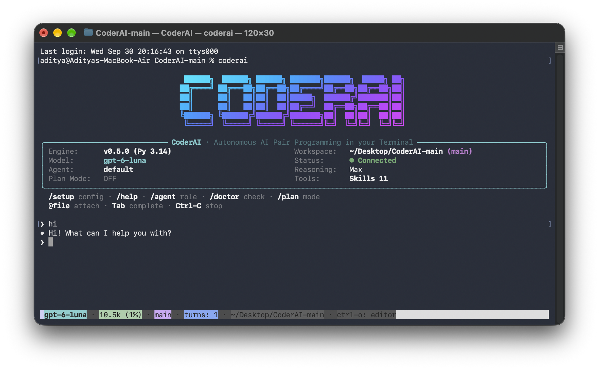

# 🤖 CoderAI

<p align="center">
  <a href="https://github.com/adityaanilraut/CoderAI/actions/workflows/ci.yml"></a>
  <strong>Autonomous AI Pair Programming & Multi-Agent Swarm in Your Terminal</strong>
</p>

<p align="center">
  
  
  
</p>

<p align="center">
  <a href="#overview">Overview</a> •
  <a href="#benchmarks">Benchmarks</a> •
  <a href="#quickstart">Quickstart</a> •
  <a href="#interactive-cli--slash-commands">Interactive CLI</a> •
  <a href="#agent-roles--swarms">Agent Roles & Swarms</a> •
  <a href="#core-tools">Core Tools</a> •
  <a href="#security--permissions">Security</a> •
  <a href="#configuration">Configuration</a> •
  <a href="#development">Development</a> •
  <a href="#license">License</a>
</p>

---


## Overview
<a id="key-features"></a>

**CoderAI** is an autonomous terminal AI software engineering platform, agentic execution engine, and multi-agent swarm designed for high reliability, deterministic tool execution, token efficiency, and developer velocity. It couples a session runtime (`coderai.soul.session.manager`), a terminal interface (`coderai.ui.shell`), and a hybrid **Kahneman System 1 (Jev / TypeSafe) + System 2 (CoderAI Deep Review)** compound reasoning harness for ultra-fast, high-precision code review.

See [Runtime architecture](docs/architecture.md) for execution boundaries and
[Verification](docs/verification.md) for the shared checks and release gates.

- 🎯 **Snippet-Anchored Editing**: Precise, hash-anchored edits with real-time staleness detection to eliminate hallucinated overwrites.
- 🔄 **Bounded Agent Loop**: Deterministic turn execution with loop guards, repeat reminders, and token compaction.
- ⚡ **JEV System-One AI Compound Engine**: Sub-second non-autoregressive diff screening & precision gating via TypeSafe, shielding developers from false-positive hallucinations and cutting review turnaround to under 7 seconds.
- 🛡️ **Defense-in-Depth Security**: 10 fine-grained permission scopes, 3 security presets, and native OS sandboxing (Seatbelt / Bubblewrap).
- ⏪ **Turn Checkpoints & Instant Undo**: Automatic `.git_history` snapshots enable one-command rollback (`/undo`) and diff inspection (`/diff`).
- 🔍 **High-Performance Search**: Native `ripgrep` integration with spill-to-disk locators for large search outputs.
- 🤖 **Multi-Agent Teams & Swarm**: Continuable background subagents, shared team task boards, and automated verification loops (`ralph`).
- 🧠 **Frontier Models & MCP**: Native reasoning token support (OpenAI, DeepSeek, Gemini, Claude) and Model Context Protocol integration.

---

## 🏆 Martian Code Review Benchmark Results

<a id="benchmarks"></a>

CoderAI was independently evaluated on the **Martian Code Review Benchmark** across **50 real-world pull requests** across 5 production enterprise repositories (`cal.com`, `keycloak`, `grafana`, `sentry`, `discourse`), competing against 30 leading commercial and open-source AI code review tools.

CoderAI placed **Rank 5 in the World**, achieving top-tier precision and balanced recall while outperforming general-purpose generative models and established commercial review bots:

| Rank | Tool | Precision | Recall | F1 Score | False Positives | Turnaround |
|:---:|---|:---:|:---:|:---:|:---:|:---:|
| 1 | `cubic-v2` | 57.8% | 57.8% | **57.8%** | 73 | 4–8m |
| 2 | `qodo-extended-v2` | 58.9% | 55.5% | **57.1%** | 67 | 3–6m |
| 3 | `augment` | 50.8% | 58.4% | **54.3%** | 98 | 2–5m |
| 4 | `qodo-v2` | 47.5% | 59.5% | **52.8%** | 114 | 3–5m |
| **5** | **CoderAI (`gpt-6-luna` + Jev)** | **58.2%** | **45.1%** | **50.8%** | **56** (1.1/PR) | **6.6s avg** |
| 6 | `qodo-extended-summary` | 38.1% | 66.4% | **48.4%** | 148 | 3–5m |
| 7 | `bugbot` | 52.8% | 43.4% | **47.6%** | 67 | 2–4m |
| 8 | `gitlab` | 46.9% | 47.4% | **47.1%** | 93 | 3–6m |
| 9 | `devin` | 59.3% | 38.7% | **46.9%** | 46 | 5–15m |
| 10 | `greptile-v4-1` | 44.7% | 48.6% | **46.5%** | 104 | 2–4m |
| 11 | `gemini-v2` | 40.3% | 51.4% | **45.2%** | 132 | 1–3m |
| 12 | `copilot-v2` | 35.2% | 63.0% | **45.1%** | 201 | 1–2m |
| 19 | `claude-code` | 42.3% | 41.0% | **41.6%** | 97 | 2–5m |
| 23 | `coderabbit` | 30.7% | 60.1% | **40.6%** | **235** | 1–3m |
| 25 | `cubic-dev` | 27.3% | 73.0% | **39.8%** | **266** | 1–3m |
| 27 | `claude` | 41.1% | 37.6% | **39.3%** | 93 | 1–3m |

### Key Benchmark Takeaways

- **Eliminating the "Noise Problem"**: Conventional generative code review agents produce **130 to 260+ False Positives** across 50 PRs (CodeRabbit: 235 FPs / 30.7% Precision, Copilot: 201 FPs / 35.2% Precision, Cubic-dev: 266 FPs / 27.3% Precision), causing severe developer alert fatigue. CoderAI produced **only 56 False Positives** (1.1 per PR) with **58.2% Precision**.
- **The Jev Precision Lift**: The Kahneman System 1 Precision Gate (`coderai/triage/`) blocked 38 speculative/hallucinated findings, yielding a **+13.0% Precision gain** and lifting CoderAI from Rank 12 into the Global Top 5.
- **Sub-7 Second Turnaround**: Total review turnaround averaged **6.63 seconds per PR** (median 5.29s), delivering instant feedback compared to 2–8 minute latencies for commercial bots.
- **Repository Performance**: CoderAI achieved **64.9% F1** on `cal.com` (69.4% Precision), **58.8% F1** on `keycloak` (65.2% Precision), and **55.3% F1** on `grafana` (59.1% Precision).
- For complete per-repository statistics and profile scoring, see [docs/benchmarks.md](docs/benchmarks.md).

---

## Installation

### From Source (Editable Mode)

```bash
# Clone the repository
git clone https://github.com/adityaanilraut/CoderAI.git
cd CoderAI

# Install in editable mode
pip install -e .

# Verify installation
coderai --version
# or using shorthand alias
cai --version
```

### Install with Development Dependencies

```bash
.venv/bin/python -m pip install -e ".[dev,jev]" -e sdks/coderai-sdk
```

---

## Quickstart

### 1. Configure Providers, API Keys & Models (Interactive Setup)

You can run the interactive setup wizard directly from the command line or from within CoderAI:

```bash
# Interactive setup wizard
coderai setup

# Or configure non-interactively
coderai setup --provider deepseek --key sk-... --setup-model deepseek-v4-pro
coderai setup --provider gemini --key AIzaSy... --setup-model gemini-3.7-flash
coderai setup --base-url http://localhost:11434/v1 --setup-model qwen2.5-coder:32b --provider ollama

# Test active provider connectivity
coderai setup --test

# View configured keys & endpoints status table
coderai setup --status
```

Alternatively, you can export environment variables in your shell or `.env` file:
```bash
export OPENAI_API_KEY="sk-..."
export DEEPSEEK_API_KEY="sk-..."
export GEMINI_API_KEY="AIzaSy..."
export ANTHROPIC_API_KEY="sk-ant-..."
```

### 2. Launch Interactive REPL

```bash
coderai
# or
cai
```

Inside the REPL, you can type `/setup` at any time to add or update API keys, switch default models, or configure local LLM endpoints.

### 3. Launch in Plan Mode

```bash
coderai --plan
```

### 4. Run a One-Shot Task

```bash
coderai "Refactor auth middleware to support JWT refresh tokens"
```

One-shot prompts default to the `core` tool preset. Use `--preset` to select one of:

- `full`: all built-in tools
- `core`: shell, file editing, reads, writes, glob, and grep
- `shell_edit`: only `bash` and `str_replace_editor`

### 5. Auto-Approve Permissions for CI / Scripting

```bash
coderai --yes "Run unit tests and fix any failing assertions in tests/test_core.py"
```

### 6. Launch with Specialized Agent Roles

```bash
# Launch interactive session with a specific role
coderai --agent architect
coderai --agent tdd-guide

# Launch with custom role specification file
coderai --agent-file .coderai/agents/code-reviewer.md
```

---

## Interactive CLI & Slash Commands

When running `coderai`, you enter an interactive REPL featuring an ASCII banner, real-time token status bar, thinking block display, live diff rendering, and command autocompletion.

### Slash Commands

| Command                | Description                                                                           |
| ---------------------- | ------------------------------------------------------------------------------------- |
| `/setup`               | Interactive setup wizard: configure API keys, providers, local endpoints & models     |
| `/continue`            | Continue bounded multi-step agent execution                                           |
| `/plan`                | Toggle Plan Mode on/off with visual indicator                                         |
| `/undo`                | Revert workspace files and history to the previous turn checkpoint                    |
| `/diff`                | Show syntax-highlighted unified diff of changes made since session start              |
| `/model [name]`        | Open interactive model selector or switch directly to a named model                   |
| `/sessions`            | Open interactive session browser (resume, delete, fork)                               |
| `/resume <id>`         | Resume a saved session directly by session ID                                         |
| `/fork [id]`           | Fork current or specified session into a new branch/session                           |
| `/delete <id>`         | Delete a saved session from workspace storage                                         |
| `/new`                 | Start a fresh session in the current project                                          |
| `/goal [action]`       | [Save and execute bounded session goals](docs/goals.md)                                           |
| `/permission [preset]` | View or set permission preset (`read-only`, `workspace-write`, `danger-full-access`)  |
| `/init`                | Generate or update `AGENTS.md` contributor guidelines for the workspace               |
| `/agent [role]`        | View or switch active agent role (`architect`, `tdd-guide`, `code-reviewer`, etc.)    |
| `/agents [action]`     | Inspect subagent runs and browse discovered role specifications (`/agents roles`)    |
| `/schedule [action]`   | View or manage scheduled reminders and background cron jobs                           |
| `/skills`              | Browse active and workspace-discovered skills                                         |
| `/skill <name>`        | Load a skill into the active session                                                  |
| `/mcp`                 | Inspect connected Model Context Protocol (MCP) servers, tools, prompts, and resources |
| `/tokens`, `/cost`     | Display detailed token usage breakdown and active context analytics                   |
| `/compact`             | Compress conversation history to reclaim context window tokens                        |
| `/config`              | View resolved workspace and user settings                                             |
| `/history`             | View turn-by-turn conversation timeline                                               |
| `/export [file]`       | Export session conversation to Markdown or JSON                                       |
| `/thinking [mode]`     | Toggle reasoning traces between full trace and concise summary                        |
| `/raw [mode]`          | Alias of `/thinking` for lite / normal / raw-scrollback display                       |
| `/clear`               | Clear terminal screen and refresh prompt status                                       |
| `/login` / `/logout`   | Log in (platform + key + model) / log out (clear credentials)                         |
| `/version`             | Show CLI version                                                                      |
| `/changelog`           | Show recent changelog (`/release-notes`)                                              |
| `/feedback [text]`     | Submit feedback (falls back to GitHub Issues)                                         |
| `/reload`              | Reload configuration without exiting                                                  |
| `/debug`               | Context debug info (messages/tokens/checkpoints/history)                              |
| `/usage`               | API usage / quota with progress bar (`/status`, `/quota`)                             |
| `/hooks`               | Show configured hooks                                                                 |
| `/task`                | Interactive background-task browser (list/detail/output)                              |
| `/upgrade`             | Upgrade coderai-agent via pip                                                         |
| `/skill:<name>`        | Load a skill via colon syntax (args passthrough)                                      |
| `/help`, `/?`          | Display categorized interactive command help menu                                     |
| `/exit`, `/quit`       | Exit session and display the exit summary card                                        |

### Tab Autocompletion & Command History

CoderAI includes full `readline` and fuzzy autocompletion:

- **Tab autocompletion**: Press `Tab` on `/` commands, `/model` targets, and `@` file paths.
- **Persistent history**: Arrow `Up` / `Down` to cycle through previous prompts across sessions (persisted at `~/.coderai/history`).

### Context Expansion (`@file` Mentions)

Mention workspace files directly anywhere in your prompts:

```text
coderai> Explain the architecture in @coderai/soul/session/manager.py and how it connects to @coderai/soul/approval.py
```

CoderAI automatically detects referenced files and attaches their contents to the prompt context. Specific line ranges can also be targeted with `@file.py:10-30` or `@file.py:L25`.

---

## Agent Roles & Swarms

CoderAI supports dynamic discovery of specialized markdown agent specifications (`.coderai/agents/*.md`, `.agents/agents/*.md`, `~/.agents/agents/*.md`), as well as decentralized multi-agent swarms:

| Role / Spec | Type | Mode | Description |
|---|---|---|---|
| `default` | Bundled | Primary | Full software engineering tool suite. |
| `okabe` | Bundled | Extended | Meticulous senior engineer with a focused tool set; inherits bundled subagents. |
| `architect` | Discovered | Read-Only | Systems architect designing components, interfaces, and boundary layers. |
| `build-error-resolver` | Discovered | General | Pinpoints root causes of compiler, build, and typecheck errors. |
| `code-reviewer` | Discovered | Read-Only | Read-only security, correctness, and architecture review. |
| `planner` | Discovered | Read-Only | Generates actionable implementation plans with phased milestones. |
| `security-reviewer` | Discovered | Read-Only | Security auditor auditing OWASP vulnerabilities, authorization, and sanitization. |
| `tdd-guide` | Discovered | General | Test-driven development specialist writing failing reproduction tests first. |

### Swarm Coordination
- **`spawn_teammate`**: Decentralized agent spawning with isolated inboxes and priority actor channels.
- **`TeamTaskBoard`**: DAG-validated task boards preventing circular dependencies and tracking blocked/in-progress statuses.
- **`wait_agent`**: Synchronization barriers supporting completion, message settlement, or timeout-based join.

### JEV System-One AI Model & Compound Review Architecture

CoderAI incorporates a hybrid **Kahneman System 1 + System 2** compound review harness (`coderai/triage/`, `coderai/jev/`). While generative autoregressive models (System 2) excel at deep syntactic, semantic, and concurrency reasoning, they suffer from verbosity and uncalibrated confidence—frequently hallucinating speculative warnings or pedantic nitpicks that cause developer fatigue.

To resolve this, CoderAI pairs System 2 with **Jev (`jev-system-one` via TypeSafe)**, a specialized non-autoregressive System 1 model providing sub-second diff screening and calibrated probability gating:

```
┌─────────────────────────────────────────────────────────────────────────────┐
│  Tier 1: System 1 Diff Triage (Jev screen_diff_hunk)                        │
│  • Sub-100ms screening of git diff hunks                                    │
│  • Bypasses inert files (lockfiles, assets, build metadata)                 │
│  • Flags high-risk hunks and concentrates System 2 attention                │
├─────────────────────────────────────────────────────────────────────────────┤
│  Tier 2: System 2 Deep Reasoning Review (CoderAI + Frontier LLM)            │
│  • Multi-file AST, semantic, and concurrency analysis                        │
│  • Catches API contract violations, dead allocations, and race conditions   │
│  • Drafts concrete findings with file/line references and failure mechanisms│
├─────────────────────────────────────────────────────────────────────────────┤
│  Tier 3: Pre-Flight Precision Gate (Jev gate_candidate_comment)             │
│  • Non-autoregressive calibrated confidence verification                    │
│  • Questions: is_actionable_bug, is_speculative_or_nit, will_developer_accept│
│  • Blocks ungrounded hallucinations, hypothetical edge cases, and noise     │
│  • Delivers a +13% Precision lift (58.2% Precision vs 30-35% for peer bots) │
└─────────────────────────────────────────────────────────────────────────────┘
```

#### Core Capabilities & Implementation Details:
- **Non-Autoregressive Fast Inference**: Single-shot `system_one(state, questions)` execution without streaming or tool overhead for instantaneous code triage (~0.5s).
- **Calibrated Tunables**: Configurable via environment variables or settings:
  - `CODERAI_JEV_GATE_THRESHOLD` (default `0.40`–`0.50`): Minimum `is_actionable_bug` probability required for approval.
  - `CODERAI_JEV_SPECULATIVE_THRESHOLD` (default `0.65`): Maximum ceiling for speculative/nit warnings before rejection.
  - `CODERAI_JEV_ACCEPT_THRESHOLD` (default `0.50`): Minimum predicted senior developer acceptance probability.
- **Fail-Safe Fallback**: Guaranteed graceful degradation to standard System 2 execution upon timeout or network latency.
- **LRU In-Memory Caching**: Bounded thread-safe caching (`CODERAI_JEV_CACHE_SIZE`) with hit/miss telemetry and hash-keyed lookups.
- **Setup**: `pip install 'coderai-agent[jev]'` and set `TYPESAFE_API_KEY` (env, `.env`, or `/setup`). Without either, `/review` operates in standalone System 2 mode.
- **Data egress & Security**: When Jev is active, `/review` sends each changed file's diff (up to `CODERAI_JEV_MAX_DIFF_CHARS`) and each drafted comment to the TypeSafe API, separately from your chat model provider. Secret-looking paths (`.env*`, `*.pem`, `*.key`, `*credential*`, `*secret*`, SSH keys) are never sent; they are always reviewed and their comments always shown.
- Read more in [docs/jev-system-one.md](docs/jev-system-one.md).

---

## Core Tools

CoderAI provides a rich, versatile tool surface:

| Tool                                       | Category     | Description                                                                                                                                    |
| ------------------------------------------ | ------------ | ---------------------------------------------------------------------------------------------------------------------------------------------- |
| **`read`**                                 | File Ops     | Reads files with offset and line limits, image support, and generates anchored `snippet_id` metadata.                                          |
| **`edit`**                                 | File Ops     | Performs precise scoped string replacement anchored to a `snippet_id` with staleness detection.                                                |
| **`write`**                                | File Ops     | Creates new files or atomically overwrites existing files.                                                                                     |
| **`str_replace_editor`**                   | File Ops     | Universal file editor (`view`, `create`, `str_replace`, `insert`, `undo_edit`).                                                                |
| **`glob`**                                 | Search       | Fast file pattern discovery with result caps and disk spilling.                                                                                |
| **`grep`**                                 | Search       | High-performance content search via bundled ripgrep binary.                                                                                    |
| **`bash`**                                 | Process      | Shell execution with timeout enforcement, process group isolation, and background jobs.                                                        |
| **`job_list` / `job_output` / `job_kill`** | Process      | Background job management and streaming output inspection.                                                                                     |
| **`pwsh`**                                 | Process      | Cross-platform PowerShell command execution.                                                                                                   |
| **`terminal_*`**                           | PTY          | Interactive pseudoterminal sessions (`terminal_open`, `terminal_send`, `terminal_read`, `terminal_signal`, `terminal_close`, `terminal_list`). |
| **`subagent` / `subagent_fork`**           | Multi-Agent  | Continuable background subagents and one-shot task delegation.                                                                                 |
| **`send_message` / `interrupt_agent`**     | Multi-Agent  | Inter-agent messaging and subagent control plane.                                                                                              |
| **`spawn_teammate` / `team_task_*`**       | Swarm        | Agent team collaboration with shared task board and synchronization (`wait_agent`).                                                            |
| **`goal` / `todo_write`**                  | Planning     | Session goal tracking and structured task breakdowns.                                                                                          |
| **`ralph`**                                | Verification | Repeat-until-done loop (`--max-ralph-iterations` and flow skills), not a separate tool name.                                                   |
| **`session_search`**                       | Search       | Keyword search over saved session titles and summaries. Alias: `session_query`.                                                                |
| **`session_trace`**                        | Search       | Recent event timeline for one saved session.                                                                                                   |
| **`session_event_search` / `session_event_read`** | Search | Search or read a slice of one session's event log.                                                                                      |
| **`WebSearch` / `WebFetch`**               | Web          | Live web search and URL fetching with SSRF protection and Markdown conversion.                                                                 |
| **`UnderstandImage`**                      | Media        | Image understanding for local visual assets.                                                                                                   |
| **`AskUserQuestion`**                      | User         | Interactive questionnaires and user decision modals.                                                                                           |
| **`Think`**                                | Reasoning    | Scratch-pad reasoning notes appended to the log (no I/O).                                                                                     |
| **`SendDMail`**                            | Steering     | Inject a directive into the running turn (time-leap steering).                                                                                 |
| **`skill`**                                | Skills       | Loads discovered workspace skills (`SKILL.md`; `/skill:<name>` colon syntax).                                                                  |

---

## Security & Permissions

CoderAI follows a **defense-in-depth, fail-closed** security model.

### Permission Scopes

| Scope            | Description                         | Default Policy |
| ---------------- | ----------------------------------- | -------------- |
| `read-in-cwd`    | Reading files within workspace      | `allow`        |
| `read-out-cwd`   | Reading files outside workspace     | `ask`          |
| `write-in-cwd`   | Writing files within workspace      | `ask`          |
| `write-out-cwd`  | Writing files outside workspace     | `ask`          |
| `delete-in-cwd`  | Deleting files within workspace     | `ask`          |
| `delete-out-cwd` | Deleting files outside workspace    | `deny`         |
| `query-git-log`  | Inspecting git status/log           | `allow`        |
| `mutate-git-log` | Committing or altering git branches | `ask`          |
| `network`        | Web search and outbound HTTP        | `ask`          |
| `mcp`            | MCP tool execution                  | `ask`          |

### Permission Presets

- **`read-only`**: Blocks all mutations and confines execution to read operations with an active OS sandbox.
- **`workspace-write`**: Grants write access only within the workspace with an active OS sandbox.
- **`danger-full-access`**: Full access with user confirmation.

---

## Configuration

Settings are resolved in order of precedence: **CLI arguments > Environment variables > Project config (`.coderai/settings.json`) > User config (`~/.coderai/settings.json`)**.

### Configuration Example (`settings.json`)

```json
{
  "model": "gpt-6-luna",
  "temperature": 0.2,
  "thinkingEnabled": true,
  "reasoningEffort": "max",
  "toolsPreset": "core",
  "permissions": {
    "preset": "workspace-write",
    "allow": ["read-in-cwd", "query-git-log"],
    "ask": [
      "write-in-cwd",
      "write-out-cwd",
      "delete-in-cwd",
      "mutate-git-log",
      "network",
      "mcp"
    ],
    "deny": ["delete-out-cwd"]
  },
  "mcpServers": {
    "sqlite": {
      "command": "uvx",
      "args": ["mcp-server-sqlite", "--db-path", "./app.db"]
    },
    "remote-docs": {
      "url": "https://mcp.example.com/sse",
      "transport": "sse",
      "headers": {
        "Authorization": "Bearer token"
      }
    }
  }
}
```

### Environment Variables

| Variable                               | Description                                                              |
| -------------------------------------- | ------------------------------------------------------------------------ |
| `OPENAI_API_KEY` / `CODERAI_API_KEY`   | LLM provider API key                                                     |
| `OPENAI_BASE_URL` / `CODERAI_BASE_URL` | API endpoint URL (OpenAI, DeepSeek, Ollama, etc.)                        |
| `CODERAI_MODEL`                        | Default model identifier                                                 |
| `CODERAI_TOOLS_PRESET`                 | Tool preset (`full`, `core`, `shell_edit`)                               |
| `CODERAI_PERMISSION_PRESET`            | Permission preset (`read-only`, `workspace-write`, `danger-full-access`) |
| `CODERAI_THINKING_ENABLED`             | Enable reasoning/thinking tokens (`true` / `false`)                      |
| `CODERAI_REASONING_EFFORT`             | Reasoning effort (`off`, `low`, `medium`, `high`, `max`)                 |
| `CODERAI_RG_PATH`                      | Explicit ripgrep path (validated PATH executable or Python fallback otherwise)           |
| `CODERAI_DEBUG_LOG_ENABLED`            | Enable verbose engine debug logging                                      |

### Migration Notes

- Project configuration and tracked agent content now use lowercase `.coderai`; rename `.coderAI` directories before upgrading.
- Workspace skills use the singular filename `SKILL.md`; rename legacy `SKILLS.md` files.
- Use `--prompt` (or a positional prompt) instead of the removed `--message` flag.
- `--preset`, `--tools-preset`, and `--permission` are aliases for the same tool-preset slot; pass only one.
- Tool presets accept only `full`, `core`, or `shell_edit`.
- Settings JSON uses the documented camelCase keys (`baseURL`, `apiKey`, `thinkingEnabled`, `reasoningEffort`, and `toolsPreset`); environment overrides use `CODERAI_*`.

---

## Development

```bash
# Format code
make format

# Run linter
make lint

# Run type checks
make typecheck

# Run main, offline SDK and wire suites (one process per file)
make test

# Full local/CI verification, including the resolved dependency audit
make check

# Run offline engine self-check
.venv/bin/python scripts/self_check.py

# Clean build artifacts
make clean
```

---

Development commands use `.venv/bin/python` by default. The [test-suite audit](docs/test-suite-audit.md) documents the completed local audit and retained contracts. See [the verification contract](docs/verification.md) for check scopes, required Jev/SDK coverage, tool pins and audit policy.

## Acknowledgements

CoderAI builds upon and adapts architectural concepts, protocol designs, and patterns from pioneering open-source agentic projects:

- **[DeepSeek Harness](https://github.com/deepseek-ai/deepseek-harness)** (MIT License):
  - **Snippet-Anchored Precision Editing**: The robust `read` (anchored `snippet_id`) to `edit` pattern with whitespace tolerance and staleness detection.
  - **Bounded Agent Loop & Token Compaction**: Deterministic turn cycles, multi-turn loop guards, and intelligent context compaction.
  - **Side-Effect Permission Scopes**: The 10-scope fail-closed security architecture (`read-in-cwd`, `mutate-git-log`, `mcp`, etc.).
  - **Interactive Terminal Workflow**: Advanced input buffering, dynamic status bar, and interactive menu patterns.

- **[Kimi Code CLI](https://github.com/MoonshotAI/kimi-code)** (by Moonshot AI, MIT License):
  - **Core Soul Runtime & Turn Execution**: The multi-step turn/step life cycle controller, asynchronous tool execution loop, and JSONL turn context persistence.
  - **Terminal UX & Slash Dispatch**: Robust interactive REPL mechanics, modular slash command action dispatcher (`/context`, `/clear`, `/sessions`, `/model`), and dynamic prompt rendering.
  - **Agent Toolset & Protocol Architecture**: Built-in file manipulation tools (`read`, `write`, `replace`, `grep`, `glob`), media handling, and Agent Control Protocol (ACP) integration.

We gratefully acknowledge and thank the creators and contributors of both **DeepSeek Harness** and **Kimi CLI** for their foundational contributions to terminal-first agentic software engineering. In compliance with the MIT License terms, original copyright notices and attribution are maintained across adapted core modules.

---

## License

MIT License. See [LICENSE](LICENSE) for details.
