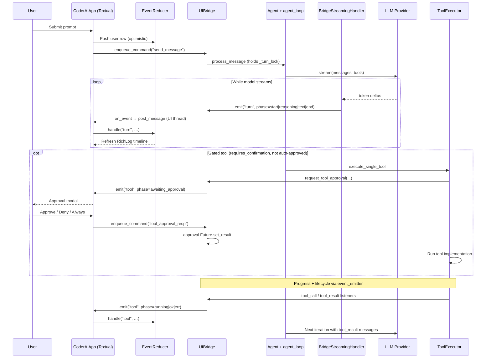

# CoderAI Architecture

This document describes the architecture and design of CoderAI. For the
chat event catalog used by the Textual UI, see
[`CHAT_EVENTS.md`](CHAT_EVENTS.md). For contributor-oriented
notes, see [`CLAUDE.md`](CLAUDE.md).

## Workflow Overview

CoderAI is a pure-Python coding agent CLI. The Click entry point in
`coderAI/cli/` (`main.py`) dispatches:

- One-shot subcommands (`config`, `history`, `models`, `status`, `cost`,
  `setup`, `info`, `doctor`, `index`, `search`, `tasks list`, and the
  `mcp` command group — `mcp list`/`add`/`remove`/`login`/`logout`/
  `resources`/`prompts`) that render output via **Rich** helpers in
  `coderAI/cli/utils.py`.
- `coderAI run`, a headless one-shot path (`coderAI/cli/run_cmd.py`) that
  runs a single prompt through the same `Agent`/`ExecutionLoop` core and
  exits — no TUI, no UIBridge, no streaming. Defaults to deny-on-mutate
  (see [`COMMANDS.md`](COMMANDS.md#coderai-run)).
- `coderAI chat`, which launches an in-process **Textual** TUI
  (`coderAI/tui/`) that drives the agent loop and renders the streaming
  timeline.

Inside the chat app, an `UIBridge` (in `coderAI/tui/controller.py`)
subscribes to the agent's `event_emitter` and forwards events to the
Textual UI via an `on_event(name, data)` callback. UI intent flows back
through `UIBridge.enqueue_command(...)` and is dispatched on the
asyncio loop. Despite the legacy name, the IPC layer no longer crosses
a process boundary — there are no subprocesses, no NDJSON pipes, and no
native UI binary.

### Communication Flow

Inbound (UI → agent) and outbound (agent → UI) are asymmetric by design.
The Textual app runs on the UI thread; the agent loop runs on a dedicated
asyncio loop in a worker thread. `UIBridge.enqueue_command` bridges them
with `call_soon_threadsafe`.



**Outbound paths (agent → timeline):**

| Path | Mechanism | Examples |
|------|-----------|----------|
| Streaming | `agent.streaming_handler` (`BridgeStreamingHandler`) calls `UIBridge.emit` | `turn` (start / reasoning / text / end) |
| Direct IPC | `UIBridge.request_tool_approval`, command handlers, `emit_*` helpers | `tool` awaiting_approval, `hello`, `ready`, `session_patch` |
| event_emitter → IPC | `UIBridge._wire_event_listeners` forwards module events | `tool` running/ok/err, `file_diff`, `agent`, `progress` |

**Inbound path (timeline → agent):** `CoderAIApp` →
`enqueue_command` / `submit_command` → `_COMMAND_HANDLERS` (e.g.
`send_message` → `agent.process_message`, `tool_approval_resp` →
unblocks the approval `Future` awaited by `ToolExecutor`).

**UI rendering:** `on_event` is `_emit_bridge`, which posts
`AgentEventMsg` to the Textual message queue. `EventReducer` owns
timeline/session state; `timeline_render.py` writes rows to the
`RichLog` on refresh (stream batches throttled ≈8 Hz).

## Project Structure

```text
.
├── docs/
│   ├── ARCHITECTURE.md      # This file
│   ├── CLAUDE.md            # Contributor-oriented notes
│   ├── COMMANDS.md          # CLI command reference
│   ├── CHAT_EVENTS.md       # Textual UI event catalog
│   ├── EXAMPLES.md
│   └── INSTALL.md
├── pyproject.toml           # Build metadata, dependencies, ruff/mypy config
├── Makefile
├── coderAI/                 # Core Python package
│   ├── cli/                 # Click entry point + subcommands
│   │   ├── main.py          # Root group; chat, info, doctor, status, …
│   │   ├── run_cmd.py       # `coderAI run` (headless one-shot)
│   │   ├── mcp_cmd.py       # `coderAI mcp` server management
│   │   └── bootstrap.py     # Shared session bootstrap (TUI + headless)
│   ├── system_prompt.py     # System prompt + dynamic tool docs
│   ├── prompts/             # MDX prompt templates (intro, interaction, output_style, tail)
│   ├── core/                # Agent orchestration
│   │   ├── agent.py         # Agent lifecycle, sessions, sub-agents
│   │   ├── agent_loop.py    # Per-turn LLM ↔ tool loop
│   │   ├── agent_tracker.py # Status, tokens, cost, cancellation
│   │   ├── agents.py        # AgentPersona loader (.coderAI/agents/*.md)
│   │   ├── tool_executor.py # Confirmation gates for risky tools
│   │   └── tool_routing.py  # ToolRegistry + MCP wire format dispatch
│   ├── system/              # Config, persistence, safeguards
│   │   ├── config.py        # ~/.coderAI/config.json + env overrides
│   │   ├── cost.py          # Token / USD tracking
│   │   ├── error_policy.py  # Retry constants and transient-error regex
│   │   ├── events.py        # EventEmitter
│   │   ├── history.py       # Session persistence
│   │   ├── hooks_manager.py # .coderAI/hooks.json
│   │   ├── locks.py         # Async resource locks
│   │   ├── project_layout.py
│   │   ├── read_cache.py
│   │   └── safeguards.py
│   ├── context/             # Context window management
│   │   ├── context.py       # Pinned-file manager
│   │   ├── context_controller.py
│   │   ├── context_selector.py
│   │   ├── code_chunker.py
│   │   └── code_indexer.py  # ChromaDB semantic index
│   ├── embeddings/          # OpenAI embeddings (default; no local provider yet)
│   ├── llm/                 # OpenAI, Anthropic, Groq, DeepSeek, Gemini, LM Studio, Ollama
│   ├── skills/              # Skill discovery + optional hosted sources
│   ├── tools/               # 91 agent tools (90 auto-discovered + manage_context)
│   │   ├── discovery.py
│   │   ├── filesystem.py, multi_edit.py, terminal.py, git.py
│   │   ├── search.py, semantic_search.py, web.py, browser.py, desktop.py
│   │   ├── memory.py, mcp.py, undo.py, subagent.py, tasks.py
│   │   ├── lint.py, format.py, testing.py, package_manager.py, refactor.py
│   │   ├── project.py, context_manage.py, planning.py, notepad.py
│   │   ├── repl.py, vision.py, skills.py
│   │   └── …
│   ├── tui/                 # Textual interactive chat
│   └── ui/                  # Rich helpers for one-shot CLI commands
└── tests/                   # Pytest test suite (66+ test modules)
```

## Component Details

### 1. CLI Layer (`coderAI/cli/`)

**Responsibility:** Command-line interface and dispatch. The `coderAI`
entry point resolves to `main()` in `coderAI/cli/__init__.py` → `cli/main.py`.

**Key entry points:**
- `main()` / `cli()` in `cli/main.py` — Click group; default invokes `chat`.
- `chat()` — Calls `coderAI.tui.run_chat_app(...)` to launch the Textual UI.
- `run` (`cli/run_cmd.py`) — headless one-shot: runs a single prompt and
  exits with no TUI (deny-on-mutate by default; `--json` for structured
  output). Shares session bootstrap with `chat` via `cli/bootstrap.py`.
- `config`, `history`, `info`, `status`, `cost`, `models`, `setup`,
  `doctor`, `index`, `search`, `tasks list` — one-shot subcommands that
  render with Rich.
- `mcp` (`cli/mcp_cmd.py`) — command group managing MCP servers in
  `~/.coderAI/mcp_servers.json` (`list`/`add`/`remove`/`login`/`logout`/
  `resources`/`prompts`).

### 2. Agent Layer (`coderAI/core/`, `coderAI/context/`)

**Responsibility:** Core orchestration logic.

**Key components:**
- `Agent` (`core/agent.py`) — Lifecycle, persona loading, provider wiring,
  session state, sub-agent spawning, tool registry filtering.
- The per-turn loop (`core/agent_loop.py`) — Retry/backoff for transient LLM
  errors, JSON-arg coercion, iteration cap. Constants
  (`MAX_RETRIES_PER_ITERATION`, `MAX_CONSECUTIVE_ERRORS`,
  transient-error regex) live in `system/error_policy.py`.
- `ToolExecutor` (`core/tool_executor.py`) — User confirmation for gated
  tools. Routes through `UIBridge.request_tool_approval` when the
  Textual UI is attached; otherwise falls back to a terminal prompt.
- `tool_routing.py` — Dispatches `function.name` to either the
  `ToolRegistry` or an MCP server (`mcp__<server>__<tool>` wire format).
- `context/context_controller.py` — Token estimation, truncation, and
  summarization. Reserves `RESPONSE_TOKEN_RESERVE=1024` and
  `TOOL_OVERHEAD_TOKENS=512` when budgeting.

### 3. LLM Providers (`coderAI/llm/`)

**Responsibility:** Abstract different LLM backends behind `LLMProvider`.

**Implementations:** `OpenAIProvider`, `AnthropicProvider`,
`DeepSeekProvider`, `GroqProvider`, `GeminiProvider`, `LMStudioProvider`,
`OllamaProvider`. Instantiation goes through `llm/factory.py::create_provider(model, config)`
— do not construct providers directly from `agent.py`.

### 4. In-process controller (`coderAI/tui/controller.py` & co.)

**Responsibility:** Bridge the agent's `event_emitter` and tool lifecycle
events to the Textual UI on the same Python process.

**Key components:**
- `UIBridge` (`tui/controller.py`) — Subscribes to `event_emitter`,
  forwards events via `on_event`, and dispatches UI commands
  (`send_message`, `set_model`, `tool_approval_resp`, etc.) back into
  the agent on the asyncio loop. The `_turn_lock` serialises user turns
  so two `send_message` commands can't interleave.
- `BridgeStreamingHandler` (`tui/streaming.py`) — Bridges LLM token deltas
  into phased `turn` events (`start` / `reasoning` / `text` / `end`).
- `tui/commands.py` — Command handlers plus plain-text reference output
  for `/show <topic>` slash commands.
- `tui/tool_metadata.py` — Tool category, risk level, and approval-preview
  helpers used by the controller and approval modals.

### 5. Textual UI (`coderAI/tui/`)

**Responsibility:** Interactive chat experience in the terminal.

**Key components:**
- `CoderAIApp` (`app.py`) — Top-level Textual app: timeline `RichLog`,
  status bar, agents panel, prompt `TextArea`, modal screens for
  approvals/pickers/search.
- `EventReducer` (`listeners.py`) — Stateful reducer that maps incoming
  agent events to `SessionState` and the timeline list. Throttles
  status updates (≤4Hz) and stream flushes (≈8Hz) so the UI stays
  smooth on fast token streams.
- `slash.py` — Local routing for `/`-prefixed input (menus, exits,
  exports) plus pass-through to `UIBridge.enqueue_command(...)` for
  agent-side commands.
- `session_setup.py` — Bootstraps an `Agent` + `UIBridge`, restores
  resumed sessions, and wires `BridgeStreamingHandler` as
  `agent.streaming_handler`.
- `timeline_render.py` — Writes timeline rows to the `RichLog` (user,
  assistant, tool, diff, toast, approval cards). `listeners.py` owns
  state; this module owns presentation.
- `diff_render.py` — Shared diff gutter formatting used by timeline rows
  and approval previews.

## Design Patterns

1. **Abstract Factory** — `LLMProvider` factory for backend switching.
2. **Registry Pattern** — `ToolRegistry` for dynamic tool discovery
   (`tools/discovery.py` walks the package and instantiates every
   no-arg `Tool` subclass).
3. **Observer Pattern** — `EventEmitter` for decoupling agent logic
   from UI updates.
4. **Command Pattern** — Slash commands are encapsulated as
   `_COMMAND_HANDLERS` keyed by name in `controller.py`.
5. **Reducer Pattern** — `EventReducer` keeps UI rendering pure: events
   in, immutable timeline + session state out.

## Security & Performance

- **Safeguards** (`system/safeguards.py`) — Interactive-command detection,
  project-directory validation, git-scope guards, staging blocklist
  for junk paths.
- **Cost guard** (`system/cost.py`) — Per-model token pricing with
  `budget_limit` enforcement from config.
- **Async I/O** — `asyncio` throughout for non-blocking LLM and tool
  calls. Read-only tools run in parallel via `asyncio.gather`; mutating
  tools run sequentially; `delegate_task` is domain-routed — read-only
  delegations (≤4 parallel), browser (≤3 parallel), desktop/workspace serial.
- **Context management** — Reactive compaction in
  `context/context_controller.py` when estimated tokens exceed
  `context_window - RESPONSE_TOKEN_RESERVE - TOOL_OVERHEAD_TOKENS`.
- **Optional tool gating** — Browser tools require Playwright; desktop tools
  require macOS; web tools can be removed from the main agent when
  `web_tools_in_main=false`.
- **Persistence** — Session-based history stored in
  `~/.coderAI/history/`; semantic index under `.coderAI/index/`.
