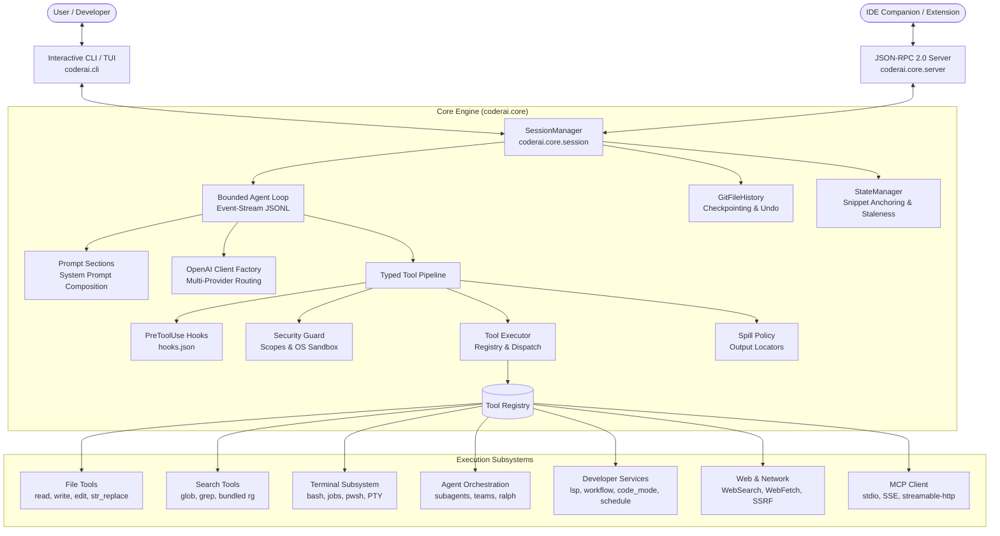

# CoderAI Architecture

CoderAI is an autonomous terminal AI pair programmer architected for high reliability, deterministic tool execution, and defense-in-depth security. The system strictly decouples the UI-agnostic engine (`coderai.core`) from interactive terminal and companion interfaces (`coderai.cli`, `coderai.core.server`).

---

## High-Level Architecture


```mermaid
graph TD
    User([User / Developer]) <--> CLI[Interactive CLI / TUI<br/>coderai.cli]
    IDE([IDE Companion / Extension]) <--> Server[JSON-RPC 2.0 Server<br/>coderai.core.server]
    
    CLI <--> SessionMgr[SessionManager<br/>coderai.core.session]
    Server <--> SessionMgr
    
    subgraph "Core Engine (coderai.core)"
        SessionMgr --> Loop[Bounded Agent Loop<br/>Event-Stream JSONL]
        SessionMgr --> GitHist[GitFileHistory<br/>Checkpointing & Undo]
        SessionMgr --> StateMgr[StateManager<br/>Snippet Anchoring & Staleness]
        
        Loop --> PromptSec[Prompt Sections<br/>System Prompt Composition]
        Loop --> Client[OpenAI Client Factory<br/>Multi-Provider Routing]
        
        Loop --> Pipeline[Typed Tool Pipeline]
        
        Pipeline --> PreHook[PreToolUse Hooks<br/>hooks.json]
        Pipeline --> SandboxGuard[Security Guard<br/>Scopes & OS Sandbox]
        Pipeline --> Executor[Tool Executor<br/>Registry & Dispatch]
        Pipeline --> SpillPolicy[Spill Policy<br/>Output Locators]
        
        Executor --> ToolRegistry[(Tool Registry)]
    end
    
    subgraph "Execution Subsystems"
        ToolRegistry --> FileOps[File Tools<br/>read, write, edit, str_replace]
        ToolRegistry --> SearchOps[Search Tools<br/>glob, grep, bundled rg]
        ToolRegistry --> TerminalOps[Terminal Subsystem<br/>bash, jobs, pwsh, PTY]
        ToolRegistry --> AgentsOps[Agent Orchestration<br/>subagents, teams, ralph]
        ToolRegistry --> DevOps[Developer Services<br/>lsp, workflow, code_mode, schedule]
        ToolRegistry --> WebOps[Web & Network<br/>WebSearch, WebFetch, SSRF]
        ToolRegistry --> MCPOps[MCP Client<br/>stdio, SSE, streamable-http]
    end
```

---

## Core Subsystems

### 1. Bounded Agent Loop & Event-Stream Persistence (`coderai.core.session`)
- **Event-Driven Lifecycle**: Every turn executes deterministically through `stream → tool_calls → permissions → execute → post-process → loop`.
- **Append-Only Event Stream**: Turn events and messages are persisted to JSONL storage without destructive rewrites.
- **Context Compaction**: Automated and manual (`/compact`) token compaction replaces older turns with a synthesized `compact/summary` event while preserving pairing-balanced tool calls and Git history.
- **Loop Guards & Repeat Reminders**: Automatically detects and prevents runaway identical tool loops with exponential reminder notices.

### 2. Snippet-Scoped File Operations (`coderai.core.state`, `coderai.core.tools`)
- **Anchored Snippet Model**: `read` operations return anchored `snippet_id` tokens capturing file content and exact version hash.
- **Staleness Guarding**: `edit` operations target a verified snippet. If external processes modify the file, edits fail safely and prompt the agent to re-read.
- **Deterministic Replacement**: Whitespace tolerance, unique string replacement, and `replace_all` guards eliminate blind overwrites.

### 3. Safety Rails, OS Sandboxing & Permissions (`coderai.core.permissions`, `coderai.core.sandbox`)
- **10 Granular Scopes**: `read-in-cwd`, `read-out-cwd`, `write-in-cwd`, `write-out-cwd`, `delete-in-cwd`, `delete-out-cwd`, `query-git-log`, `mutate-git-log`, `network`, `mcp`.
- **Preset Modes**: `read-only`, `workspace-write`, `danger-full-access`.
- **OS Sandboxing**: Integrates native OS-level sandboxing (macOS `sandbox-exec`/Seatbelt and Linux `bwrap`/bubblewrap) for bash execution.
- **PreToolUse Hooks**: Claude/Codex-compatible pre-execution validation scripts loaded from `.coderai/hooks.json`.

### 4. Git-Backed Turn Checkpointing & Instant Undo (`coderai.core.common.file_history`)
- **Turn Checkpoints**: Every turn automatically commits workspace file snapshots into `.git_history`.
- **Instant Rollback**: The `/undo` slash command rolls back file state to any prior turn checkpoint without corrupting the working tree.
- **Unified Diff**: The `/diff` command renders syntax-highlighted diffs across turns.

### 5. Multi-Agent Orchestration & Teams (`coderai.core.agents`, `coderai.core.teams`)
- **Continuable Subagents**: Background subagents (`subagent`) with inter-agent messaging (`send_message`), interruption (`interrupt_agent`), and listing (`list_agents`).
- **One-Shot Delegation**: Forked subagents (`subagent_fork` / `Task`) with specialized personas and isolated workspaces.
- **Agent Teams & Swarm**: Teammate spawning (`spawn_teammate`), shared task boards (`team_task_*`), and multi-agent synchronization (`wait_agent`).
- **Ralph Verification Loop**: Automated goal-driven verification and test validation harness (`ralph`).

### 6. Developer Tooling & Languages
- **Language Server Protocol (`coderai.core.lsp`)**: Symbol definition, reference lookup, workspace symbols, and document symbol navigation.
- **PTY Terminal Sessions (`coderai.core.terminal`)**: Persistent pseudoterminals (`terminal_create`, `terminal_send`, `terminal_read`, `terminal_close`).
- **Workflow Scripting Engine (`coderai.core.workflow`)**: Multi-phase async execution pipelines with structured logging and parallel task branches.
- **Code Mode (`coderai.core.code_mode`)**: Sandboxed in-process Python execution for data transformation and batch computation.
- **Session Query & Search (`coderai.core.session_query`)**: Full-text indexing and fuzzy search across past sessions and conversations.

### 7. MCP Subsystem (`coderai.core.mcp`)
- **Transports**: Supports `stdio`, `sse` (Server-Sent Events), and `streamable-http`.
- **Full MCP Protocol**: Dynamic discovery and invocation of MCP Tools, Prompts, and Resources.
- **Configuration**: Multi-server definitions in `.coderai/settings.json` and `~/.coderai/settings.json` with environment variable expansion and private IP policies.

---

## Directory Structure

```
coderai/
├── main.py                         # CLI entry point
├── py.typed                        # PEP 561 marker
│
├── cli/                            # Rich Terminal UI Layer
│   ├── app.py                      # Main REPL, CLI parser, event loop
│   ├── ascii_art.py                # Banner and styling
│   ├── completer.py                # Tab autocompletion & fuzzy matching
│   ├── diff_render.py              # Syntax-highlighted diffs
│   ├── exit_summary.py             # Session analytics & exit cards
│   ├── export_render.py            # Session export formatting
│   ├── file_mention.py             # @file context expansion
│   ├── fuzzy.py                    # Fuzzy subsequence ranking
│   ├── interactive_menu.py         # Interactive menus (models, sessions, skills)
│   ├── plan_render.py              # Plan checklist renderer
│   ├── status_bar.py               # Real-time token & model status bar
│   ├── thinking.py                 # Reasoning / thinking block renderer
│   ├── tool_card.py                # Tool execution cards
│   └── welcome.py                  # Welcome screen
│
├── core/                           # Core Engine
│   ├── agents.py                   # Continuable subagent manager
│   ├── goals.py                    # Session goals store (/goal)
│   ├── hooks.py                    # PreToolUse hook execution
│   ├── jobs.py                     # Background process job store
│   ├── openai_client.py            # LLM provider routing & factory
│   ├── permissions.py              # 10 scopes, policy evaluation, presets
│   ├── prompt.py                   # System prompt builder
│   ├── prompt_sections.py          # Stable tool order & section builder
│   ├── sandbox.py                  # OS sandbox (Seatbelt / bwrap)
│   ├── schedule.py                 # Schedule subsystem
│   ├── session.py                  # SessionManager & agent turn loop
│   ├── session_log.py              # JSONL event stream & message derivation
│   ├── settings.py                 # Settings resolution
│   ├── spill.py                    # Spill-to-file store & locators
│   ├── state.py                    # Snippet manager & staleness detection
│   ├── subagent.py                 # Subagent orchestration
│   ├── web_providers.py            # Pluggable web search backends
│   │
│   ├── code_mode/                  # Interactive Python execution engine
│   ├── common/                     # Core utilities & helpers
│   ├── lsp/                        # Language Server Protocol client
│   ├── mcp/                        # Model Context Protocol client
│   ├── network/                    # HTTP client, SSRF guard, HTML sanitizer
│   ├── server/                     # JSON-RPC 2.0 IDE companion server
│   ├── session_query/              # Full-text session indexer & search
│   ├── teams/                      # Agent swarm & task board
│   ├── terminal/                   # PTY terminal manager
│   ├── tools/                      # Built-in tool implementations
│   ├── vendor/                     # Bundled binaries (ripgrep)
│   └── workflow/                   # Multi-phase workflow scripting engine
│
└── skills/                         # Built-in agent skills
```
