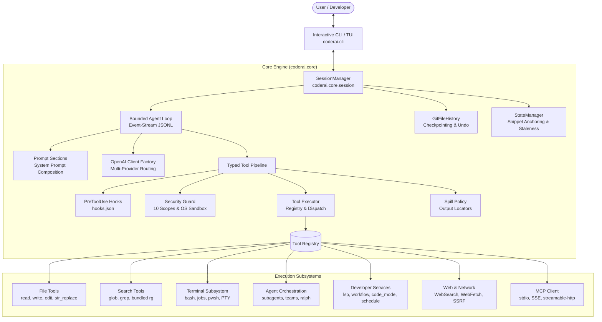

# 🏗️ CoderAI Architecture & System Design

For full architectural documentation, refer to the root [ARCHITECTURE.md](../ARCHITECTURE.md).

---

## Quick Architectural Overview

**CoderAI** is an autonomous terminal AI pair programming system architected for high reliability, deterministic tool execution, token efficiency, and defense-in-depth security. The codebase strictly decouples the UI-agnostic core engine (`coderai.core`) from the rich interactive terminal interface (`coderai.cli`).

```mermaid
graph TD
    User([User / Developer]) <--> CLI[Interactive CLI / TUI<br/>coderai.cli]
    
    CLI <--> SessionMgr[SessionManager<br/>coderai.core.session]
    
    subgraph "Core Engine (coderai.core)"
        SessionMgr --> Loop[Bounded Agent Loop<br/>Event-Stream JSONL]
        SessionMgr --> GitHist[GitFileHistory<br/>Checkpointing & Undo]
        SessionMgr --> StateMgr[StateManager<br/>Snippet Anchoring & Staleness]
        
        Loop --> PromptSec[Prompt Sections<br/>System Prompt Composition]
        Loop --> Client[OpenAI Client Factory<br/>Multi-Provider Routing]
        
        Loop --> Pipeline[Typed Tool Pipeline]
        
        Pipeline --> PreHook[PreToolUse Hooks<br/>hooks.json]
        Pipeline --> SandboxGuard[Security Guard<br/>10 Scopes & OS Sandbox]
        Pipeline --> Executor[Tool Executor<br/>Registry & Dispatch]
        Pipeline --> SpillPolicy[Spill Policy<br/>Output Locators]
        
        Executor --> ToolRegistry[(Tool Registry)]
    end
    
    subgraph "Execution Subsystems"
        ToolRegistry --> FileOps[File Tools<br/>read, write, edit, str_replace]
        ToolRegistry --> SearchOps[Search Tools<br/>glob, grep, bundled rg]
        ToolRegistry --> TerminalOps[Terminal Subsystem<br/>bash, jobs, pwsh, PTY]
        ToolRegistry --> AgentsOps[Agent Orchestration<br/>subagents, teams, ralph]
        ToolRegistry --> DevOps[Developer Services<br/>lsp, workflow, code_mode, schedule]
        ToolRegistry --> WebOps[Web & Network<br/>WebSearch, WebFetch, SSRF]
        ToolRegistry --> MCPOps[MCP Client<br/>stdio, SSE, streamable-http]
    end
```

See [ARCHITECTURE.md](../ARCHITECTURE.md) for in-depth breakdown of subsystems, sequence diagrams, safety rails, and data persistence models.
